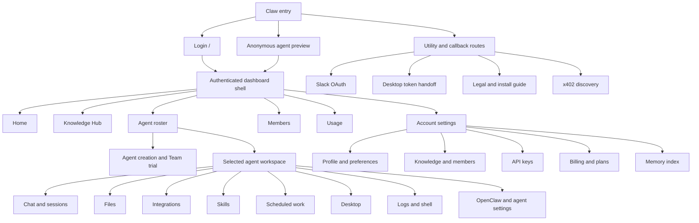

# HyperCLI Claw Product Sitemap and Functional Audit

> Audit date: 2026-08-06<br>
> Base commit: `b2ece6e4a0b57ceab3e2eff79e0995af42236e19`<br>
> Audited target: the current working tree, including concurrent uncommitted changes<br>
> Deployed commit/Netlify deploy ID: unknown<br>
> Product scope: `site/apps/claw` and the shared UI/SDK surfaces it directly consumes

## 1. Audit Contract

This document is the canonical functional sitemap for HyperCLI Claw. It records what a user can reach, what each surface does, the state and service dependencies behind it, and where the implementation is weak, misleading, incomplete, duplicated, or insufficiently verified.

This is a product sitemap, not an XML search-engine sitemap. The application is primarily a query-driven product shell, so routes alone do not describe its information architecture. Query values, drawers, dialogs, callbacks, runtime-gated controls, and hidden or disabled implementations are treated as sitemap nodes.

### Scope

Included:

- All 25 Next.js page routes and the `/.well-known/x402` route handler.
- Public, anonymous, authenticated, callback, compatibility, static, dev-only, disabled, and unreachable surfaces.
- Account navigation, agent roster, agent creation, lifecycle, workspace tools, Knowledge Domains, access management, usage, settings, billing, plans, trials, and utility flows.
- Loading, empty, partial, error, permission, runtime, gateway, responsive, and persistence states.
- Direct dependencies in `site/packages/shared-ui` and `ts-sdk` when they determine Claw behavior.
- Source-level, automated-test, local-browser, and deployed read-only evidence.

Excluded:

- The HyperCLI marketing and Console products except where they hand users into Claw.
- Destructive or billable live validation. No real purchase, agent creation/deletion, OAuth completion, external message, or grant mutation was performed.
- Claims about backend behavior that are not expressed by a checked-in contract, SDK behavior, test, or read-only response.

### Snapshot Limitation

The working tree was already dirty, changed concurrently during the audit, and contained an unresolved merge conflict in `site/tests/claw/agents-chat-navigation.spec.ts`. The frozen final status sample contained 58 changed/untracked/unmerged entries. The audit therefore describes the working tree observed during the audit, not a reproducible clean-commit release. A patch hash would be misleading because concurrent edits and untracked files were not frozen into one artifact. Existing changes were not reverted or modified. The conflicted chat-navigation browser suite was not run. The deployed site's commit identity was unavailable, so deployed observations prove deployment behavior but not source parity with this working tree.

### Classification Model

| Dimension      | Values and meaning                                                         |
| -------------- | -------------------------------------------------------------------------- |
| Role           | Page, alias, callback/utility, machine endpoint, static asset              |
| Exposure       | Production, Preview, Legacy, dev-only, disabled, orphaned, missing         |
| Reachability   | Navigable, direct-only, environment-gated, unreachable                     |
| Implementation | Implemented, partial, placeholder, absent                                  |
| Deployment     | Verified, broken, not checked, not applicable                              |
| Authority      | Frontend source, backend catalog/API, runtime capability, external service |

Route and feature tables use compact combined labels, but findings keep implementation, deployment, and authority separate. `Dynamic` means the backend/runtime is authoritative; it is not a maturity status.

Compact labels used below:

| Label                  | Expanded meaning                                                                                         |
| ---------------------- | -------------------------------------------------------------------------------------------------------- |
| Live                   | Production exposure; implemented in source                                                               |
| Live, authenticated    | Production exposure; implemented; client authentication boundary                                         |
| Live and Dynamic       | Production exposure; implemented; backend/runtime authoritative                                          |
| Live bridge            | Production exposure; implemented navigation/summary bridge rather than an authoritative mutation surface |
| Preview, Live          | Preview exposure; implemented                                                                            |
| Legacy, Live           | Legacy exposure; implemented                                                                             |
| Live with placeholders | Production exposure; partially implemented                                                               |
| Alias                  | Route role; source redirect behavior                                                                     |
| Utility                | Callback/token/machine role                                                                              |
| Duplicate/bridge       | Role/IA relationship, not maturity                                                                       |

### Evidence Legend

| Evidence channel | Meaning                                                                 |
| ---------------- | ----------------------------------------------------------------------- |
| Source           | Traced through current UI, hooks, SDK calls, and route logic            |
| Test present     | A relevant checked-in automated test exists                             |
| Test run         | The test was executed during this audit                                 |
| Local browser    | Exercised with mocked/intercepted APIs in Playwright                    |
| Deployed         | Confirmed with a read-only request to `https://agents.dev.hypercli.com` |

Outcomes are recorded separately as pass, fail, partial, flaky, stale, blocked, or not run.

### Verification Summary

| Check                         | Evidence/outcome             | Command or observation                                 | Notes                                                                                                                                                                                 |
| ----------------------------- | ---------------------------- | ------------------------------------------------------ | ------------------------------------------------------------------------------------------------------------------------------------------------------------------------------------- |
| Claw unit/component tests     | Test run: pass               | `npm run test:claw`                                    | 161 files, 1,993 tests                                                                                                                                                                |
| Claw production build         | Test run: pass               | `npm run build -w @hypercli/claw`                      | Next recognized 25 page routes plus one dynamic route handler; only 18 page routes yield route-specific deployed HTML, and this command does not verify the assembled static artifact |
| Claw lint                     | Test run: pass with warnings | `npm run lint -w @hypercli/claw`                       | 0 errors, 65 warnings; dominated by React purity/effect/ref warnings. The apparent `alt` warning targets a Lucide SVG component and is a false positive                               |
| Deterministic UI detector     | Test run: warnings           | `detect.mjs --json site/apps/claw/src`                 | 13 warnings; several are test/dead-code/regex false positives, with remaining visual consistency issues treated as P3                                                                 |
| Anonymous desktop browser     | Local browser: partial       | Targeted Playwright against isolated production server | 6 of 7 tests passed; New Domain test is stale and waits for a disabled tour control                                                                                                   |
| Anonymous mobile browser      | Local browser: pass          | Targeted mobile Chromium Playwright                    | 4 tests passed, including authentication gates and Team trial entry                                                                                                                   |
| Mobile authenticated mock     | Local browser: partial/flaky | Targeted mobile Chromium Playwright                    | Navigation, settings, billing, and full-width file editor passed in isolation; an earlier concurrent route transition aborted                                                         |
| x402 checkout browser test    | Test run: stale              | `plans-x402-route.spec.ts`                             | Product renders `Purchase`; test waits for nonexistent accessible name `Purchase Pro`                                                                                                 |
| Chat-navigation browser suite | Blocked                      | Source inspection                                      | Existing unresolved merge conflict prevents parsing                                                                                                                                   |
| Deployed static route matrix  | Deployed: fail               | Read-only HTTP body/header probes                      | Five aliases, two dynamic ID pages, x402, crawler paths, and unknown paths are masked by the root app shell                                                                           |
| Deployed dashboard            | Deployed: reachable          | `GET /dashboard/agents`                                | Netlify returned a canonical 301 to `/dashboard/agents/`, which returned Claw HTML with current theme/runtime assets                                                                  |
| Documented wallet download    | Deployed: fail               | Read-only HTTP/content-type probes                     | Documented `hypercli.com` URL returns marketing HTML; agents prod/dev hosts return the 8,684,232-byte binary as `text/plain`                                                          |

## 2. Executive Assessment

Claw is a broad operating environment rather than a simple agent list. Its strongest surfaces are agent chat/session behavior, files, creation/capacity handling, Knowledge Domain operations, and component-level state coverage. The main risk is not lack of capability; it is that a very large set of capabilities is compressed into one query-routed client page with overlapping account navigation, inconsistent canonical URLs, incomplete production boundaries, and uneven end-to-end verification.

### Health Snapshot

| Area                         | Assessment                         | Primary concern                                                                                                                                                                        |
| ---------------------------- | ---------------------------------- | -------------------------------------------------------------------------------------------------------------------------------------------------------------------------------------- |
| Agent chat and sessions      | Strong                             | Real-gateway behavior remains less covered than component and mocked-browser behavior                                                                                                  |
| Agent files                  | Strong with policy gap             | Gateway source can bypass protected-file policy                                                                                                                                        |
| Creation and lifecycle       | Broad but non-transactional        | Failures after creation can leave an orphaned agent                                                                                                                                    |
| Knowledge and access         | Broad but duplicated               | Knowledge Hub and Shared knowledge maintain different Domain selection models                                                                                                          |
| Integrations                 | Large catalog, uneven reachability | Advertised registry and actually discoverable/configurable tiles diverge                                                                                                               |
| Skills and schedules         | Functional                         | No live-gateway mutation E2E; timezone and persistence copy need clarification                                                                                                         |
| Billing and plans            | Broad                              | Duplicate entry points, stale tests, static plan documentation, and broken deployed route behavior                                                                                     |
| Settings                     | Broad but coupled                  | Account Profile depends on a selected agent                                                                                                                                            |
| Accessibility and responsive | Partial                            | Good focus/touch patterns in places, but almost no systematic automated a11y enforcement                                                                                               |
| Delivery and CI              | Weak                               | Build and selected Chromium E2E run, but publishing does not depend on those jobs; unit, lint, accessibility, most browser specs, and assembled-artifact routing are not release gates |
| Product truth                | Mixed                              | Several placeholders, no-op/dormant actions, inferred metrics, and stale legal/internal documentation                                                                                  |

### Highest-Priority Conclusions

1. The static deployment assembler drops server redirects, dynamic ID pages, machine endpoints, route headers, and real 404 behavior. This breaks deep links and x402 discovery.
2. `billingMock=active-no-slot` can replace authoritative billing presentation in production.
3. Agent creation is a multi-system sequence without rollback after the deployment is created.
4. Desktop login transfers a reusable bearer token through an unbound custom-scheme callback without state, PKCE, or a one-time code.
5. CI validates a different serving architecture from production and allows publishing without waiting for Claw quality jobs.
6. Account Profile is unusable when the user has no selected agent.
7. Knowledge selection, account/Domain usage scope, and multiple account entry points make the product's current context hard to reason about.
8. The legal copy needs review against the product's persistent conversations, files, backups, schedules, settings, caches, and Knowledge sources.

## 3. Product Sitemap



### Canonical Authenticated Navigation

| Group                   | Nodes                                                                              |
| ----------------------- | ---------------------------------------------------------------------------------- |
| Primary                 | Home, Knowledge Hub                                                                |
| My Agents               | Launch agent, searchable/reorderable agent roster                                  |
| Administration          | Members, Usage                                                                     |
| Account menu            | API Keys, Plans, Billing, Settings, Documentation, Theme, Sign out                 |
| Selected agent          | New Session, Files, Integrations, Skills, Scheduled, Desktop, recent conversations |
| Selected agent advanced | Logs, Shell, OpenClaw Settings, Settings                                           |

The standalone-page header uses a second navigation model that also exposes Shared knowledge. This difference is a source of discoverability and canonical-URL drift.

### Naming Contract

| Term                         | Meaning                                                                            |
| ---------------------------- | ---------------------------------------------------------------------------------- |
| HyperCLI Agents              | Current user-visible account/platform name used by login and some product surfaces |
| Claw                         | Repository/application name and the scope of this audit                            |
| OpenClaw                     | One agent runtime and gateway implementation; not the generic platform model       |
| HyperClaw                    | Legacy hostname/install-file naming only                                           |
| Knowledge Domain             | User-facing name for the backend Workspace entity                                  |
| Agent workspace              | Product area for one selected agent                                                |
| OpenClaw workspace directory | Runtime filesystem under the agent environment                                     |
| Slack workspace              | A Slack tenant; unrelated to a Knowledge Domain or agent filesystem                |

Canonical UI capitalization is Knowledge Hub, Shared knowledge, API Keys, Scheduled, and Memory index.

## 4. Route Atlas

### Page Routes

| Route                          | Access                                | Classification                              | Purpose and behavior                                                                                                                 | Primary source                                 |
| ------------------------------ | ------------------------------------- | ------------------------------------------- | ------------------------------------------------------------------------------------------------------------------------------------ | ---------------------------------------------- |
| `/`                            | Public                                | Live                                        | Login wall; authenticated users move to Home; preserves Team trial and plan handoffs                                                 | `src/app/page.tsx`                             |
| `/dashboard/agents`            | Public preview; authenticated product | Live                                        | Canonical product shell for account views, administration sections, roster, agent workspace, launch, checkout recovery, and settings | `src/app/dashboard/agents/page.tsx`            |
| `/agents`                      | Public                                | Source alias; deployment-broken             | Redirects to `/dashboard/agents`, preserving query entries; deployed static artifact serves root HTML instead                        | `src/app/agents/page.tsx`                      |
| `/dashboard`                   | Dashboard auth boundary               | Source alias; deployment-broken             | Redirects to `view=overview`, removing conflicting route selectors; deployed static artifact serves root HTML instead                | `src/app/dashboard/page.tsx`                   |
| `/usage`                       | Public redirect                       | Source alias; deployment-broken             | Redirects to `view=usage`; deployed static artifact serves root HTML instead                                                         | `src/app/usage/page.tsx`                       |
| `/dashboard/settings`          | Dashboard auth boundary               | Source alias; deployment-broken             | Redirects to `view=settings`; deployed static artifact serves root HTML instead                                                      | `src/app/dashboard/settings/page.tsx`          |
| `/dashboard/knowledge`         | Dashboard auth boundary               | Legacy source alias; deployment-broken      | Redirects to `section=knowledge`, not the current Knowledge Hub; deployed static artifact serves root HTML instead                   | `src/app/dashboard/knowledge/page.tsx`         |
| `/dashboard/agents/[id]/files` | Dashboard auth boundary               | Implemented, direct-only; deployment-broken | Standalone file browser; `?file=` selects an initial preview; no current production link found; deployed deep links serve root HTML  | `src/app/dashboard/agents/[id]/files/page.tsx` |
| `/keys`                        | Client auth boundary                  | Live                                        | Standalone API-key manager                                                                                                           | `src/app/keys/page.tsx`                        |
| `/dashboard/keys`              | Dashboard auth boundary               | Duplicate                                   | Same API-key manager under the dashboard layout                                                                                      | `src/app/dashboard/keys/page.tsx`              |
| `/plans`                       | Client auth boundary                  | Live                                        | Standalone catalog, subscription, entitlement, checkout, cancellation, and code activation                                           | `src/app/plans/page.tsx`                       |
| `/adjust-plan`                 | No explicit route boundary            | Live bridge                                 | Account-wide comparison page; selections route to `/plans` rather than changing an agent                                             | `src/app/adjust-plan/page.tsx`                 |
| `/dashboard/billing`           | Dashboard auth boundary               | Live                                        | Billing overview, subscriptions, capacity, token pool, receipts, portal, cancellation, and codes                                     | `src/app/dashboard/billing/page.tsx`           |
| `/dashboard/billing/[id]`      | Dashboard auth boundary               | Implemented; deployment-broken              | Receipt/payment detail suitable for print/save; deployed deep links serve root HTML                                                  | `src/app/dashboard/billing/[id]/page.tsx`      |
| `/desktop-login`               | Self-authenticating                   | Utility                                     | Privy login and token handoff to allowlisted desktop custom schemes                                                                  | `src/app/desktop-login/page.tsx`               |
| `/slack/start`                 | Self-authenticating                   | Utility                                     | Starts account-level Slack relay OAuth                                                                                               | `src/app/slack/start/page.tsx`                 |
| `/slack/status`                | Self-authenticating                   | Utility                                     | Shows Slack installation/debug status and reconnect controls                                                                         | `src/app/slack/status/page.tsx`                |
| `/slack/success`               | Public callback                       | Utility                                     | Displays OAuth result and redirects to dashboard settings after ten seconds                                                          | `src/app/slack/success/page.tsx`               |
| `/privacy`                     | Public                                | Live                                        | Privacy policy                                                                                                                       | `src/app/privacy/page.tsx`                     |
| `/terms`                       | Public                                | Live                                        | Terms and Conditions                                                                                                                 | `src/app/terms/page.tsx`                       |
| `/dev/agent-setup`             | Publicly addressable                  | Dev-only                                    | Onboarding prototype that can use real billing, create an agent, and write starter files                                             | `src/app/dev/agent-setup/page.tsx`             |
| `/dev/agent-setup/signup`      | Public                                | Dev-only                                    | Simulated signup that stores email in session storage without real authentication                                                    | `src/app/dev/agent-setup/signup/page.tsx`      |
| `/dev/agent-setup/agents`      | Client auth boundary                  | Dev-only                                    | Separate large agent-dashboard prototype using real APIs                                                                             | `src/app/dev/agent-setup/agents/page.tsx`      |
| `/dashboard/dev/chat`          | Dashboard auth boundary               | Dev-only                                    | In-memory chat/design playground; production renders a blocked message                                                               | `src/app/dashboard/dev/chat/page.tsx`          |
| `/dashboard/dev/chat/files`    | Dashboard auth boundary               | Dev-only                                    | Mutable mock file browser with no equivalent production guard                                                                        | `src/app/dashboard/dev/chat/files/page.tsx`    |

### Machine and Static Routes

| Route/resource                 | Status                         | Function                                            | Weak point                                                                                                                   |
| ------------------------------ | ------------------------------ | --------------------------------------------------- | ---------------------------------------------------------------------------------------------------------------------------- |
| `GET /.well-known/x402`        | Source-live, deployment-broken | Builds an x402 discovery document from public plans | Dev deployment returns HTTP 200 HTML, not JSON                                                                               |
| `/HYPERCLAW_INSTALL.md`        | Public static                  | CLI installation/onboarding guide                   | Hardcodes commercial plans, prices, limits, and payment amounts                                                              |
| `/instructions`                | Alias                          | Netlify 302 to installation guide                   | Inherits static-catalog drift                                                                                                |
| `/upgrade`                     | Alias                          | Netlify 302 to installation guide                   | Inherits static-catalog drift                                                                                                |
| `/site.webmanifest`            | Public static                  | Standalone app metadata and icons                   | Missing `id`, `start_url`, and `scope`                                                                                       |
| `/binaries/x402-wallet`        | Public executable              | Linux x86-64 x402 wallet binary                     | No in-product link or checked-in provenance/build reference; deployed MIME is `text/plain`; the docs point to the wrong host |
| `/binaries/x402-wallet.sha256` | Public checksum                | Digest for x402 wallet binary                       | Contains only a digest, so conventional `sha256sum -c` fails without a filename                                              |
| Root icons                     | Public static                  | Favicon, Android, Apple, and Slack app icons        | No functional issue observed                                                                                                 |
| `/logos/*`                     | Public static                  | Four HyperCLI SVG assets                            | No functional issue observed                                                                                                 |
| `hyperclaw.app/*`              | Host alias                     | 301 to `agents.hypercli.com`                        | None observed                                                                                                                |
| `www.hyperclaw.app/*`          | Host alias                     | 301 to `agents.hypercli.com`                        | None observed                                                                                                                |
| `/robots.txt`                  | Missing in source              | Search crawler policy                               | Deployed catch-all returns root HTML with HTTP 200                                                                           |
| `/sitemap.xml`                 | Missing in source              | Search-engine URL inventory                         | Deployed catch-all returns root HTML with HTTP 200; indexing policy is unresolved                                            |

### Static Deployment Contract

The production assembler in `.github/scripts/site_container_entrypoint.sh` copies `public/`, Next static assets, and emitted `.html` files. It does not deploy a Next server runtime. It then writes these Netlify rules:

- `/_next/static/* /_next/static/:splat 200`
- `/job/* /job 200`
- `/billing/* /billing 200`
- The app's checked-in redirects.
- `/* /index.html 200` as a final catch-all.

Consequences confirmed on the dev deployment:

- Probe target/date: `https://agents.dev.hypercli.com`, 2026-08-06. The deploy commit SHA and Netlify deploy ID were not available.
- Five server redirect routes are masked by the root document.
- `/dashboard/agents/[id]/files` and `/dashboard/billing/[id]` are masked by the root document.
- `/.well-known/x402` is masked by the root document.
- The generated `/job/* /job 200` and `/billing/* /billing 200` rewrites resolve to HTTP 404 because Claw emits neither `/job` nor `/billing`; they do not reach the final root catch-all.
- `robots.txt`, `sitemap.xml`, and unknown paths return root HTML with HTTP 200 instead of absent/404 semantics.
- Configured Next response headers, including the `/dev/agent-setup/*` COOP header, are not materialized by this assembler.
- Root, alias, dynamic-ID, and unknown-path probes returned the same SHA-256 body: `6e25f303a6f45247b7af506ead0166fbd09397a27ff3b4e7025a93df1ab5384a`.

Eighteen static page paths have route-specific emitted HTML. Seven source page paths require behavior that the assembled static artifact does not preserve. The exact assembled output directory was not served locally in this audit; the finding triangulates source-build output, assembler code, and deployed read-only probes.

### URL State Contracts

The following parameters apply to `/dashboard/agents` unless noted otherwise.

| Parameter                               | Accepted values/shape                                                                                     | Result                                                                      |
| --------------------------------------- | --------------------------------------------------------------------------------------------------------- | --------------------------------------------------------------------------- |
| `view`                                  | `overview`, `usage`, `settings`                                                                           | Selects an account-level surface                                            |
| `section`                               | `knowledge-hub`, `knowledge`, `members`                                                                   | Selects an administration surface                                           |
| `agentId`                               | Deployment ID                                                                                             | Selects an account agent                                                    |
| `session`                               | Routable OpenClaw session key                                                                             | Selects a conversation                                                      |
| `tab`                                   | `chat`, `files`, `integrations`, `skills`, `scheduled`, `logs`, `shell`, `openclaw`, `settings`           | Selects an agent workspace surface                                          |
| `domainId`                              | Workspace/Domain ID                                                                                       | Initializes Knowledge Hub selection                                         |
| `settings`                              | `profile`, `preferences`, `agent`, `workspace`, `members`, `api-keys`, `billing`, `plans`, `memory-index` | Selects a settings subsection                                               |
| `open`                                  | `agent-launcher`, `launcher`, `launch-agent`                                                              | Opens or auth-gates agent creation, then is consumed                        |
| `plan`                                  | Backend plan ID                                                                                           | Prefers a launcher/checkout plan; `team` also supports trial handoff        |
| `intent`                                | `trial`                                                                                                   | Starts the Team trial flow after authentication                             |
| `integration`                           | `telegram`, `discord`, `slack`, `whatsapp`, `github`                                                      | Opens integration detail when a matching `agentId` is present               |
| `checkout`                              | `success`, `cancelled`                                                                                    | Starts checkout-return reconciliation                                       |
| `session_id`                            | Stripe checkout session ID                                                                                | Required for current success recovery                                       |
| `cancelled`                             | `true`                                                                                                    | Legacy checkout-cancelled signal                                            |
| `slack_oauth_ok`                        | `true`, `false`                                                                                           | Slack callback result                                                       |
| `slack_oauth_error`                     | Text                                                                                                      | Slack callback error detail                                                 |
| `slack_team_id`                         | Slack team ID                                                                                             | Emitted by callback; no active consumer found                               |
| `journey`, `journeyDay`, `journeyReset` | Preview/public Journey state                                                                              | Controls the environment-gated guided Journey                               |
| `billingMock`                           | `active-no-slot`                                                                                          | Replaces local billing presentation with a mock state; not production-gated |

Invalid authenticated `view` and `tab` values are removed. Invalid settings values fall back to Profile. Anonymous access removes `agentId`, `session`, `integration`, `section`, `settings`, `tab`, `view`, `slack_oauth_ok`, and `slack_oauth_error`. It retains public plan/trial intent as well as `open`, `domainId`, `checkout`, `session_id`, `cancelled`, `slack_team_id`, Journey parameters, `billingMock`, and unknown parameters; `open` is separately consumed after triggering its authentication gate, while some other retained values are inert until authentication or a matching view is active.

Additional route contracts:

| Surface                             | Parameter contract                                                                                                                      |
| ----------------------------------- | --------------------------------------------------------------------------------------------------------------------------------------- |
| `/dashboard/agents/[id]/files`      | `file=<path>` selects the initial preview                                                                                               |
| `/dashboard/keys`                   | `apiKeysPreview=empty` forces an empty key-manager preview outside production                                                           |
| `/desktop-login`                    | `redirect_uri` may be absent, exactly `backseatdriver://auth`, or exactly `hypercli://auth`; every other value is rejected              |
| `/slack/success`                    | `ok=true                                                                                                                                | false`, optional trimmed `team_id`, and optional trimmed `error` drive result copy and mapped dashboard parameters |
| `/dashboard/knowledge`              | Legacy `focusAgent` takes precedence over `agentId`; `session` is preserved; unrelated parameters are discarded                         |
| Journey                             | Boolean query values recognize `1`, `true`, `yes`, and `on` versus `0`, `false`, `no`, and `off`; `journeyDay` selects days 1 through 7 |
| Plans and dashboard checkout return | `checkout`, `session_id`, and legacy `cancelled` drive pending-checkout recovery                                                        |

Alias normalization:

- `/agents` forwards all query parameters, including repeated values.
- `/dashboard`, `/usage`, and `/dashboard/settings` force their target `view`, remove `view`, `section`, `tab`, and `open`, and preserve compatible remaining parameters.
- `/dashboard/knowledge` maps only `focusAgent`/`agentId` and `session` to the legacy Shared knowledge route.

## 5. Authentication, Shell, and Navigation

### Authentication

- Global identity uses Privy through `ClawProviders` and shared auth providers.
- `/dashboard/agents` is the exact public dashboard exception because it hosts the anonymous preview.
- Other `/dashboard/*` routes use `PrivyAuthRouteBoundary`, which redirects in the client after auth resolution.
- `/keys` and `/plans` add their own client boundaries.
- Slack and desktop-login routes manage their own authentication sequence.
- There is no server middleware/proxy auth boundary in the Claw app.
- API authorization remains the actual security boundary; route privacy must not be treated as backend authorization.
- Logout clears Claw/app tokens, the auth cookie, local auth state, and Privy state.

### Desktop and Mobile Shell

| Mode              | Behavior                                                                                  |
| ----------------- | ----------------------------------------------------------------------------------------- |
| Expanded desktop  | Account roster and selected-agent workspace sidebar are simultaneously visible            |
| Collapsed desktop | Icon rail preserves Home, Knowledge Hub, launch, agents, Members, Usage, and account menu |
| Mobile            | A Sheet contains account navigation and the selected-agent workspace navigation           |
| Mobile settings   | Full-width settings menu transitions to a separate details view                           |
| Standalone pages  | Use `DashboardNav`, which exposes a different account-navigation model                    |

### Navigation Persistence

- Home, Usage, and Settings links preserve current `agentId` and canonical session where possible.
- Settings section changes use browser history without requesting a new App Router page.
- Agent selection updates `agentId` and session state and clears incompatible account/administration selectors.
- Roster order, stopped-agent visibility, and sidebar collapse are browser-local preferences.
- Selected Domain is persisted per principal, but current Knowledge Hub selection does not update that global preference.

### Anonymous Product Preview

- Rotates every ten seconds through Chat, Files, Integrations, Skills, Scheduled, and Desktop.
- Stops automatic rotation after the visitor explicitly selects a preview surface.
- Pauses while authentication, launcher, or tour overlays are open.
- Allows public plan/trial context while preventing private agent, Domain, usage, billing, and file reads.
- Routes launch, trial, and Domain-creation intent through authentication without exposing saved setup drafts.

Weak point: automatic rotation has no explicit pause control and no reduced-motion check. Manual selection stops it, but that behavior is not announced.

## 6. Home and Account Operations

**Entry:** `/dashboard/agents?view=overview`<br>
**Status:** Live, authenticated
**Primary implementation:** `src/components/dashboard/AccountOperationsHome.tsx`, `src/hooks/useAccountOperationsOverview.ts`

### Functions

- Greeting and manual refresh.
- Daily token capacity and remaining capacity.
- Recent conversations from reachable running OpenClaw gateways.
- Next scheduled jobs and links into an agent's schedule.
- Most-used agents and agents quiet for at least one week.
- Knowledge Domains and known direct agent access.
- Launch-first-agent and launch-another-agent actions.
- Resume a specific conversation.
- Open Usage, Knowledge Hub, a Domain, an agent, or Scheduled work.

### Operational States

- Initial roster loading.
- Gateway snapshot loading, ready, partial, unavailable, offline, and runtime-not-applicable.
- Domain access loading, known, restricted, and unavailable.
- No agents, no conversations, no schedules, no Domains, or Domains with no assigned agents.
- Unknown token capacity remains unknown rather than being presented as zero.

### Dependencies

- Agent roster and deployment state.
- `operationsSnapshot` from each supported running OpenClaw gateway.
- Workspace list and admin-only grant reads.
- Account `agentUsage(1)` for daily token data.
- Bounded concurrency of three gateway and four Domain-access requests.

### Weak Points

- Home is an on-demand operational brief, not an audit log; users cannot inspect historical agent events or job outcomes.
- Recent activity is incomplete whenever gateways are offline, unsupported, or restricted.
- Meeting data, persistent activity history, job execution results, and knowledge-use telemetry do not exist and must not be inferred.

### Guided Journey

**Entry:** environment mode plus `journey`, `journeyDay`, and `journeyReset` URL state<br>
**Exposure:** Environment-gated (`off`, `preview`, or `public`)

Seven missions:

| Day | Mission                    | Product action                           |
| --- | -------------------------- | ---------------------------------------- |
| 1   | Give Your Agent A Brief    | Create an agent or start a guided brief  |
| 2   | Show It What Matters       | Open Files and add a trusted source      |
| 3   | Set The Rules              | Open settings and define boundaries      |
| 4   | Try Real Work              | Seed a safe first-task prompt            |
| 5   | Review What It Understood  | Seed an understanding-review prompt      |
| 6   | Connect Where Work Happens | Open Integrations and capability choices |
| 7   | Make It Repeatable         | Seed a repeatable-workflow prompt        |

Functions:

- Render Journey introduction/mission cards in chat or a floating panel.
- Select or skip missions.
- Trigger product surfaces or prepared prompts.
- Record completion events and user-visible receipts.
- Collapse and drag the floating panel and persist its position.
- Reset or preview through URL/local state.

Weak point: Journey capability links use `builtin-*` IDs, but the active integration directory rejects IDs that are not active tiles. The action can open the general directory instead of the requested detail while still recording a receipt and potentially completing the Connections mission.

## 7. Agent Roster, Creation, Trial, and Lifecycle

### Agent Roster

**Entry:** bare `/dashboard/agents` or any agent workspace URL<br>
**Status:** Live

Functions:

- Load all account agents through the deployment client.
- Select URL-requested, current, or first available agent.
- Search the expanded roster.
- Drag reorder on desktop and keyboard move where exposed.
- Show or hide stopped agents; stopped agents are visible by default.
- Collapse/expand the roster and use compact avatar navigation.
- Display status, identity, avatar, usage, and hover details.
- Launch an agent and hand deletion into a confirmation flow.
- Subscribe to deployment invalidations and perform bounded recovery refreshes.

Persistence:

| Preference                  | Storage                                               |
| --------------------------- | ----------------------------------------------------- |
| Roster order                | `claw.agentRosterOrder.v1[:domainId]`                 |
| Show stopped agents         | `claw.agentRosterShowOffline.v1`                      |
| Account roster collapsed    | `claw.agentRosterCollapsed.v1`                        |
| Workspace sidebar collapsed | Browser local storage under the workspace sidebar key |

Weak points:

- Roster loading also waits on selected-Domain association loading even though the visible roster is account-wide.
- Account and selected-Domain concepts coexist without a visible global Domain picker, increasing scope ambiguity.

Existing external agents:

- Agents with `managed=false` retain an explicit display name rather than using the managed-name derivation.
- They expose a separate Slack handle and use dedicated external-agent profile/avatar APIs.
- Claw can display and edit existing external-agent identity, but provides no external-agent creation/import or API-key rotation control even though client-library operations exist.

### Agent Creation

**Entry points:** roster launch action, Home, empty states, preview CTAs, `open=agent-launcher`, selected plan, and Journey actions<br>
**Status:** Live

Stages:

| Stage             | Functions                                                                                                       |
| ----------------- | --------------------------------------------------------------------------------------------------------------- |
| Identity          | Friendly display name, generated deployment handle/name, icon/category, optional initial Knowledge Domain       |
| Advanced identity | Custom runtime image, protected browser desktop, memory indexing                                                |
| Workspace         | Generate deterministic OpenClaw bootstrap files, optionally enhance files with inference, review/edit file pack |
| Capacity          | Load backend plans, subscription summary, current plan, and agent types; choose an available slot/tier          |
| Checkout          | Embedded Stripe card or Base USDC/x402 when no suitable capacity exists                                         |
| Launch            | Create stopped agent, upload files, grant Domain, start, refresh roster, select agent, open chat                |

Creation guards and states:

- Selected Domain must still exist and require admin access when used.
- Launch plans and agent sizes come from backend catalogs; no static fallback is substituted.
- Explicit states exist for catalog unavailable, billing unavailable, no capacity, slot release pending, payment reflected but entitlement pending, Pro requirements, and backend reservation failure.
- Setup drafts are principal/workspace scoped and stored in session storage with a volatile fallback.
- Restored drafts offer Continue setup and Start fresh.
- Launch without a Knowledge Domain is valid; ambient Domain selection is never inferred.
- `shouldOfferWorkspaceCreation` is currently hardcoded false, so the dormant pre-launch Domain creation path is bypassed.

### Team Trial

**Entry:** sidebar trial action, Add capacity dialog, embedded first-agent capacity step, and marketing/auth handoff via `?intent=trial&plan=team`<br>
**Status:** Live in current working tree; source/unit/browser entry verified, real checkout not performed

Functions:

- Shows a seven-day Team trial offer to anonymous users and eligible authenticated accounts.
- Requires all subscription views to confirm no subscription history before offering an authenticated trial.
- Preserves trial intent through login.
- Calls the dedicated Stripe trial-checkout operation.
- Persists a principal-scoped `team-trial` or `first-agent-trial` checkout record. Expected bundle and baseline-slot fields are conditional.
- First-agent trials retain setup, workspace, Knowledge Domain, and agent-size context.
- Reconciles both active trial metadata and trial-granted launch slots after return.
- Writes a setup ID into created-agent metadata and checks it before auto-creation to reduce duplicate launches after recovery.
- Shows active plan name, authoritative end time, and a minute-updated time-remaining label.
- Routes active trial management to Billing.

Weak points:

- The UI advertises a fixed seven-day duration while authoritative duration comes from the backend after activation.
- The current browser verification covers the authentication entry, not a real Stripe trial completion.

### Checkout and Capacity Recovery

- Stripe and x402 purchases persist pending checkout state by principal.
- Successful Stripe returns poll payment/subscription and entitlement/slot reflection separately.
- Paid and trial-backed first-agent setup can resume and auto-create once capacity appears.
- Checkout cancellation clears pending state and reports no change.
- Additive plans show owned bundle counts and permit purchasing another bundle.
- Activation/grant codes can be redeemed from plans and billing surfaces.
- Subscription cancellation is scheduled at period end where supported.

### Plan Comparison

- Reachable from Add capacity and the first-agent setup wizard.
- Read-only and driven entirely by the backend plan catalog.
- Compares price, included slots, largest agent size, token/rate limits, models, and catalog features.
- Shows an explicit unavailable state rather than remembered plan data.

### Launch Sequence and Failure Semantics

1. Create an OpenClaw deployment with `start: false`.
2. Upload starter/bootstrap files.
3. Grant the agent viewer access to the selected Knowledge Domain.
4. Start OpenClaw.
5. Refresh the account roster.
6. Select the agent and open chat.

If steps 2 through 6 fail, the deployment created in step 1 is retained and the UI reports a partial-success message. There is no compensating delete/rollback transaction.

### Runtime Lifecycle

| State            | User treatment                                         |
| ---------------- | ------------------------------------------------------ |
| `PENDING`        | Provisioning runtime                                   |
| `RESTORING`      | Restoring files                                        |
| `RESTORE_FAILED` | Restore failure and recovery guidance                  |
| `SYNCING`        | Synchronizing shared knowledge                         |
| `SYNC_FAILED`    | Sync failure and recovery guidance                     |
| `STARTING`       | Booting runtime                                        |
| `RUNNING`        | Runtime is up; gateway readiness is tracked separately |
| `STOPPING`       | Shutdown and cleanup in progress                       |
| `STOPPED`        | Start prompt and backup-file availability              |
| `FAILED`         | Failure detail and restart path                        |

Lifecycle actions:

- Rename canonical and display names through serialized mutation queues.
- Update avatar/profile metadata.
- Start with capacity/tier guidance.
- Resize and start in one serialized client sequence.
- Stop after ending private chat and apply a local cleanup cooldown.
- Delete after confirmation, clear pins/selection/session state, select a neighboring agent, refresh the roster, and poll for slot release.
- Merge stale list responses without overwriting newer local mutations.

## 8. Selected Agent Workspace

### Availability Matrix

| Capability                |                             Agent required |  Running required | Gateway required | Other gate                                                        |
| ------------------------- | -----------------------------------------: | ----------------: | ---------------: | ----------------------------------------------------------------- |
| Chat/send/stream          |                                        Yes |               Yes |              Yes | Chat-primary runtime and send authority                           |
| Session list/private chat |                                        Yes |               Yes |              Yes | Session capability and hydration                                  |
| Live files                |                                        Yes |               Yes |               No | Deployment file API                                               |
| Backup files              |                                        Yes |                No |               No | Backup/S3 API                                                     |
| Gateway files             |                                        Yes |               Yes |              Yes | OpenClaw runtime                                                  |
| Integrations              |                                        Yes |           Usually |              Yes | Runtime channel/config capabilities                               |
| Skills                    |                                        Yes |           Usually |              Yes | Skills provider capabilities                                      |
| Scheduled work            |                                        Yes | Yes for mutations |              Yes | Cron capability                                                   |
| Desktop                   | Preview without agent; live agent required | Yes for live open |               No | Hostname and fresh token; entitlement denial can route to upgrade |
| Logs                      |                                        Yes |               Yes |               No | Logs WebSocket                                                    |
| Shell                     |                                        Yes |               Yes |               No | Shell WebSocket                                                   |
| Agent launch settings     |                                        Yes |                No |          Partial | Deployment update API                                             |
| OpenClaw config/models    |                                        Yes |          Normally |              Yes | Config/schema/models capabilities                                 |

Shell-primary runtimes (`opencode`, `codex`, `claude-code`, `goose`, and `kimi-code`) route to Shell rather than Chat by default.

### Chat

**Tab:** `chat`, canonical with no `tab` parameter<br>
**Status:** Live

Functions:

- Load and progressively hydrate transcript history.
- Send streaming messages and abort active generation.
- Queue sends across session transitions.
- Retry or recover from gateway/startup conditions.
- Render Markdown, GFM, math, syntax-highlighted code, Mermaid, media, file references, and tool calls.
- Present grouped tool-call stacks, running/completed states, results, and directory visualizations.
- Attach files by picker, drag/drop, file-browser selection, and folders.
- Upload image collections with bounded concurrency and safe manifests.
- Record microphone audio, preview it, upload it, and attach it to chat.
- Type `@` to open ranked workspace-file autocomplete, navigate results by keyboard, and add selected files as pending attachment chips.
- Use slash commands and integration setup cards.
- Select conversation model and thinking variant.
- Show read-only connected-channel conversations.
- Scroll to bottom and display streaming indicators.

The slash-command menu defines 42 commands across chat, lifecycle, files, configuration/models, skills, integrations, schedules, diagnostics, plans, and billing:

`menu`, `new`, `stop`, `summary`, `retry`, `clear`, `start`, `new-agent`, `status`, `rename`, `files`, `open`, `upload`, `mkdir`, `write`, `diff`, `config`, `tools`, `models`, `model`, `skills`, `skill`, `connect`, `connections`, `probe`, `schedule`, `run`, `unschedule`, `activity`, `sessions`, `logs`, `shell`, `refresh`, `plan`, `plans`, `billing`, `fix`, `test`, `ship`, `explain`, `todo`, and `handoff`.

Commands capability-check unavailable actions. Destructive or mutating operations use confirmation where the command implementation requires it. Registry skill search/status/install and runtime actions depend on currently loaded provider capabilities.

States:

- Agent startup/provisioning/sync/failure.
- Gateway connecting, reconnecting, disconnected, unsupported, and ready.
- History loading, empty session, active response, aborting, queued message, upload/read progress, and attachment removal.
- Read-only channel session and missing send authority.

Weak points:

- Real gateway E2E is much narrower than the extensive hook/component coverage.
- Main orchestration remains embedded in the very large dashboard page, which makes independent route/error behavior difficult to test.

### Sessions

Functions:

- Create a conversation using native subscribe/create when available, with older-gateway fallback.
- Switch sessions and persist the selected route.
- Pin/unpin sessions as browser-local preferences.
- Rename through gateway session patch, with compatibility fallback.
- Archive/delete through gateway patch and select/create a replacement conversation.
- Preserve per-target drafts and active thinking state.
- Cache session lists and derive fallback display names.
- Hide internal main, heartbeat, ephemeral, and subagent sessions from normal navigation.
- Replace bare/scoped main navigation with generated dashboard sessions.

Weak points:

- Repository guidance and `BACKEND_SESSION_REQUIREMENTS.md` describe older behavior and conflict with current session APIs.
- The mock gateway lacks the preferred native subscribe/create path, so mocks primarily exercise compatibility behavior.
- The principal chat-navigation browser spec is currently unmerged and could not run.

### Private Chat

Functions:

- Start only from a connected, ready, empty/new normal conversation with no active reply.
- Create an ephemeral gateway session.
- Hide the conversation from Sessions and browser history storage.
- Remove transcript, stream, draft, and cache state on end, agent/session change, page hide, or unmount.
- Expose `inactive`, `starting`, `active`, and `ending` states.
- Warn that agent actions can still affect shared files, memory, integrations, and settings.

### Files

**Tab:** `files`; standalone route also exists<br>
**Status:** Live

Sources:

| Product source | Backend source    | Availability                  | Mutations                                                                        |
| -------------- | ----------------- | ----------------------------- | -------------------------------------------------------------------------------- |
| Agent          | Live pod          | Running agents                | Browse, preview, upload, create folder, edit, download, delete subject to policy |
| Backup         | S3/backup         | Running or stopped            | Browse, preview, upload/edit where supported, download, delete subject to policy |
| Gateway        | OpenClaw file RPC | Running OpenClaw with gateway | Text read/write; no upload, directory creation, or delete                        |

Functions:

- Breadcrumb navigation, search, sorting, source tabs, and comparison status.
- Preview image, audio, video, PDF, ZIP, EPUB, Markdown, HTML, code/text, and binary fallback.
- Edit text and save.
- Upload files and directories where supported.
- Create directories using `.hypercli-folder` marker objects.
- Download bytes, copy text, and open a full-width mobile editor drawer.
- Recover reads through source fallback for internal callers.
- Protect `AGENTS.MD`, `BOOTSTRAP.MD`, `SOUL.MD`, `HEARTBEAT.MD`, and `MEMORY.MD` through the product policy.

Weak points:

- Shared file UI skips the read-only/protected-file friction for Gateway text files, so core files can become writable through Gateway even when protected elsewhere. This is inconsistent safety UX, not an authorization boundary; users can already replace files through other writable paths.
- Gateway file RPC is text-only, so binary Gateway preview/download is correctly unavailable.
- Real gateway text reads/writes and deployment upload paths are not covered end to end.

### Browser Desktop

Functions:

- Keep Desktop listed in navigation; anonymous users can open a product preview.
- Require a selected running agent and ready hostname for live opening.
- Route to upgrade only when `hasDesktop` is not true and entitlement data explicitly denies Desktop; otherwise attempt the tokenized route.
- Pre-open a popup to reduce popup blocking.
- Request a fresh desktop token and navigate to a protected browser-desktop URL.
- Configure desktop enablement, route exposure, and launch image in agent launch options.

Weak points:

- No E2E opens and validates the actual protected desktop URL/token handoff.
- Desktop-login security behavior is source-verified but lacks direct automated tests.

### Integrations

**Tab:** `integrations`<br>
**Status:** Live and Dynamic

Directory functions:

- Search and filter integration entries.
- Start with five baseline tiles: Telegram, Discord, Slack, WhatsApp, and GitHub.
- Add tiles for runtime-reported channels.
- Use registry metadata to decorate tiles already created; the active directory does not enumerate the registry.
- Refresh/probe status and show partial-status warnings.
- Open configured account details and specialized setup workflows.
- Open generic registry detail only when a runtime-reported channel produced a matching tile.
- Display disconnected, connecting, unsupported-runtime, unavailable-provider, partial, empty, and error states.

Specialized flows:

| Integration                      | Functions                                                                                                       |
| -------------------------------- | --------------------------------------------------------------------------------------------------------------- |
| Telegram                         | Protected token/config workflow, verification, account selection, disconnect                                    |
| Discord                          | Protected bot configuration, verification, account selection, disconnect                                        |
| Slack                            | Hosted relay or self-hosted setup, OAuth/account attachment, status, reconnect                                  |
| WhatsApp                         | QR pairing and status lifecycle                                                                                 |
| GitHub                           | Device authorization, status, Shell recovery path                                                               |
| Runtime-reported registry plugin | Conditionally open generic enable/config detail via schema/config path                                          |
| Built-in registry capability     | Unreachable through the active directory; no built-in tile is created, and the specialized panels are not wired |

Generated connector workflow:

- Direct setup first asks the runtime for authoritative setup instructions.
- When direct instructions are unavailable, an ephemeral prompt generates validated guidance.
- Guides can expose conditional secure inputs, external links, copy actions, approved Shell proposals, and live connection tests.
- Workflow guidance is cached per agent and refreshed by age/prompt-revision policy.

Registry coverage:

- 23 Chat & Messaging entries are present even though the source comment says 22.
- 32 AI Model Provider entries.
- 26 Tools & Services entries.
- 6 built-in registry entries; their specialized panel implementations are orphaned from the active directory.
- 81 external entries plus 6 built-ins are present, for 87 total; the source comment incorrectly says 80 external plus 6 built-ins.
- The complete registry is listed in Appendix A.

Weak points:

- The 87-entry registry and the smaller active directory are materially disconnected. Registry-defined providers/tools are not automatically advertised or discoverable from All integrations.
- Generated connector guidance can remain stale after a runtime/image change because freshness checks use age and prompt revision while the storage key is agent-only; runtime fingerprint should participate in validation.
- No production E2E completes a real connector setup.
- Account-level Slack and agent-level Slack use related but different flows, increasing mental-model complexity.

### Skills

**Tab:** `skills`<br>
**Status:** Live and Dynamic

Functions:

- Search by name, description, ID, category, requirements, binaries, environment, and OS.
- Filter by source and category.
- Inspect status, requirements, activation, Markdown, and resource files.
- Load installed-skill documents and provider resources.
- Create manually, generate with AI, or import `.md`/`.txt` skills.
- Edit skill documents/resources and configure requirements.
- Enable/disable when the provider supports it.
- Create immutable draft revisions.
- Test a draft in a linked chat session and save from the test result.
- Recover drafts after interrupted work.
- Persist drafts through IndexedDB, then local storage, then memory fallback.

Weak points:

- Preview copy says browser changes last for the current session, while IndexedDB/local-storage drafts can persist across sessions.
- No live-gateway E2E exercises install, enable, or resource mutation.

### Scheduled Work

**Tab:** `scheduled`<br>
**Status:** Live

Functions:

- List and refresh jobs.
- Create with presets, limited natural-language parsing, or a five-field cron expression.
- Validate schedule and preview the next five occurrences.
- Select a target session.
- Edit by creating a replacement and then removing the old job.
- Run a job immediately.
- Delete after confirmation.
- Normalize runtime jobs for Home agenda display.

Current constraints:

- Requests use UTC and `wakeMode: "now"`.
- One-shot jobs, model overrides, delivery options, and enable/disable controls are unavailable.
- Execution history and results are unavailable.

Weak points:

- UTC input semantics are under-explained while occurrence output is shown in browser-local time.
- Replacement-first editing is non-atomic and can leave duplicate jobs if removal fails.
- No real-gateway scheduled-job E2E exists.

### Logs

**Tab:** `logs`<br>
**Status:** Live

Functions:

- Connect to the deployment logs WebSocket with refreshed credentials.
- Bound retained lines and characters.
- Batch UI publication and handle tab visibility.
- Reconnect with backoff and classify connection state.
- Auto-scroll output.

Weak points:

- Output force-scrolls to the bottom on every batch, making historical inspection difficult.
- The underlying clear operation is not exposed by the current controller UI.
- No real deployment WebSocket E2E exists.

### Shell

**Tab:** `shell`<br>
**Status:** Live

Functions:

- Activate only for a selected running agent and keep the connection warm after first use.
- Acquire fresh credentials with timeout and abort stale requests.
- Connect through the deployment shell WebSocket.
- Render xterm with lazy loading/prewarming, WebGL fallback, bounded history, and idle disposal.
- Handle UTF-8 output, bounded queues, paste backpressure, terminal resize, and reconnect/backoff.

Weak points:

- No real deployment WebSocket E2E exists.

### OpenClaw Runtime Settings

**Tab:** `openclaw`; presented as a drawer while Chat remains the center surface<br>
**Status:** Live and Dynamic

Functions:

- Load runtime config and schema.
- Render scalar, sensitive, advanced, nested object, dynamic map, and JSON fields.
- Save a patch for the active top-level configuration section.
- Configure channels, providers, tools, and runtime-specific values exposed by the schema.
- List/select models and thinking variants.
- Add custom models to configured providers.

Weak points:

- Backdrop and close actions discard unsaved changes without a dirty-state warning.
- Runtime support depends on schema/capability reporting; no route-level fallback exists if the drawer throws.

### Agent Settings

**Tab:** `settings`<br>
**Status:** Live with placeholders

Sections:

| Section | Functions                                                                                                                                                                       |
| ------- | ------------------------------------------------------------------------------------------------------------------------------------------------------------------------------- |
| General | Account profile name/avatar/email/UUID and agent-adjacent identity presentation                                                                                                 |
| Agent   | Canonical/display name, handle, avatar, lifecycle, environment, Desktop, shared-knowledge launch settings, default model; Docker-image editor remains mounted in a hidden block |
| Index   | Semantic memory index, session/search sync, watcher, debounce, periodic interval                                                                                                |
| Usage   | Links to account Usage, API Keys, and current plan limits; no embedded per-agent metrics                                                                                        |
| Team    | Domain members currently links to account Overview; Shared channels links to the bare dashboard                                                                                 |

The workspace sidebar's Agent Settings action opens `view=settings&settings=agent` and renders only the Agent subsection. The full five-section `tab=settings` panel remains separately addressable through direct/internal actions.

Weak points:

- Auto-archive contributes to dirty state but saving only updates local React state; no remote persistence operation exists.
- Visibility is a disabled placeholder.
- Team actions are generic links rather than task-specific destinations.
- A fallback launch pipeline is duplicated in `AgentList`, increasing drift risk.

## 9. Knowledge Domains and Access

### Domain Model

The backend calls this object a Workspace; the product calls it a Knowledge Domain. The Workspaces service is authoritative for Domains, source files, generated Markdown, metadata, search, and direct user/agent grants.

Provider functions:

- Create an authenticated Workspaces client.
- List Domains and restore principal-scoped selection.
- Provision a protected General Domain when absent.
- Select a Domain and persist that selection.
- Load selected-Domain agent associations.
- Create Domains and grant an agent viewer access.
- Fall back from `listAgents` to active agent grants for older services.

Weak points:

- A catalog read can mutate backend state by creating General.
- The current main navigation has no visible global Domain picker even though Members and overview sections depend on global Domain selection.

### Knowledge Hub

**Entry:** `section=knowledge-hub`, optionally `domainId=<id>`<br>
**Status:** Preview, Live

Functions:

- Search Domains and apply All, Ready, Processing, Needs attention, and Empty filters.
- Create, rename/update, refresh, and delete Domains.
- Protect General from deletion.
- Upload source documents by picker or drag/drop.
- Poll processing catalogs every eight seconds.
- Preview original source or generated Markdown.
- Download the original source.
- Edit summary, keywords, and metadata.
- Regenerate generated content.
- Delete sources.
- Assign and revoke direct agent viewer grants.
- Render responsive Domain, source, and inspector panes.
- Show external connectors as Coming Soon without fabricated data.

Permissions:

| Role        | Knowledge Hub capability                                |
| ----------- | ------------------------------------------------------- |
| Viewer      | Read-only Domain and source access                      |
| Contributor | Upload and modify source material                       |
| Admin       | Domain details/deletion and agent assignment management |

States:

- Initial loading and background refresh.
- Catalog unavailable and no Domains.
- No filter results and empty Domain.
- Source list unavailable.
- Processing, ready, and failed source.
- Assignment list unavailable and agent roster unavailable.
- Partial upload/revoke failure.

Weak points:

- `domainId` initializes selection, but in-page Domain changes do not update the URL or global Workspace context.
- File metadata update, regenerate, and delete rely more heavily on rendered UI guards and backend enforcement than other operations' direct hook-level role checks.

### Shared Knowledge

**Entry:** `section=knowledge` or legacy `/dashboard/knowledge`<br>
**Status:** Legacy, Live

Functions:

- Create, edit, and delete Domains.
- Expand a file browser and search sources.
- Upload, preview, regenerate, download, edit metadata, and delete files.
- Grant and revoke agent access.
- Update global selected Workspace/Domain state.

Weak points:

- It overlaps the newer Knowledge Hub while using a different selection model.
- The legacy redirect points here rather than to Knowledge Hub.
- Users receive both “Knowledge Hub” and “Shared knowledge” without a crisp product-level distinction.

### Members and Direct Access

**Entry:** `section=members` or `settings=members`<br>
**Status:** Live

Functions:

- Select a Domain and refresh access.
- Resolve current user identity.
- List direct user and agent access for admins.
- Show current-access-only mode for non-admins.
- Add user access by resolved user UUID.
- Add account agents as principals.
- Select viewer, contributor, or admin role.
- Add optional expiration.
- Search active users/agents.
- Revoke grouped active grants with partial-failure reporting.
- Show revoked and expired history.

Weak points:

- There is no email lookup/invitation in the active Members surface.
- Existing role or expiration cannot be edited even though the SDK exposes grant update.
- No explicit UI guard prevents self-removal, owner removal, or last-admin removal before the backend rejects it.
- Human entry requires an opaque UUID copied from Profile.

## 10. Usage and Analytics

**Entry:** `view=usage`<br>
**Status:** Live

Functions:

- Select a reporting period.
- Load usage summary, usage history, and API-key usage.
- Render token totals and history chart.
- Render request totals and integration activity.
- Render API-key/integration usage detail.
- Render selected-Domain agent rows.
- Use separate one-day usage data for per-agent token display elsewhere in the dashboard.

States:

- Loading.
- Partial success when one or two calls fail.
- Full error only when every usage call fails.
- No collected data.
- Unknown per-agent attribution.

Weak points:

- Aggregate usage is account-wide while the agent table is selected-Domain scoped.
- Aggregate requests/integrations/tokens are assigned to an agent only when the account has exactly one agent; otherwise rows show `---`.
- Zero values are also rendered as `---` in places, conflating zero, unknown, and unavailable.
- Partial failures are largely silent.
- A separate React Query `useUsage` hook is unused.

## 11. Account Settings

**Entry:** `/dashboard/agents?view=settings&settings=<id>`<br>
**Status:** Live

Every settings detail header exposes a Feedback action that opens `mailto:support@hypercli.com` with a Claw feedback subject.

### Settings Sitemap

| Group          | ID             | Label         | Functions                                                                                                        | Key weakness                                                         |
| -------------- | -------------- | ------------- | ---------------------------------------------------------------------------------------------------------------- | -------------------------------------------------------------------- |
| Personal       | `profile`      | Profile       | Full name, read-only email, User UUID/copy, avatar upload/delete, sign out                                       | Requires a selected agent even though fields are account-level       |
| Personal       | `preferences`  | Preferences   | Aurora light/dark theme, startup/loading experience, Slack account status/connect/reconnect/debug                | Slack disconnect unavailable                                         |
| Personal       | `agent`        | Agent         | Agent identity, runtime, environment, desktop, knowledge sync, default model, lifecycle                          | Requires selected agent; includes placeholders                       |
| Administration | `workspace`    | Knowledge Hub | Domain overview, agents, members, source count, usage links                                                      | Not the full Knowledge Hub; member count is synthetic                |
| Administration | `members`      | Members       | Domain access directory and grant/revoke operations                                                              | UUID-only humans; no role edit                                       |
| Administration | `api-keys`     | API Keys      | List, search, filter, create, reveal/copy, rename, disable, permissions                                          | Creation initializes full access; least privilege is not the default |
| Administration | `billing`      | Billing       | Overview, invoices, subscriptions, capacity, token pool, receipts, portal, cancellation, codes, trial management | Duplicate standalone surface                                         |
| Administration | `plans`        | Plans         | Dynamic catalog, current plan, bundles, checkout, cancellation, codes                                            | Duplicate standalone surface                                         |
| Administration | `memory-index` | Memory index  | Semantic search, session/search sync, watcher, debounce, interval                                                | Requires selected agent/runtime config                               |

### Profile Details

- Account full name loads/saves through user profile APIs.
- Email is displayed read-only.
- User UUID is copyable for access grants.
- Avatar accepts PNG, JPEG, WebP, or GIF up to 2 MiB.
- Avatar can be uploaded or deleted.
- The main account shell separately loads name and avatar, duplicating profile requests.

Confirmed defect: if no agent is selected, Settings renders “Select an agent” and the shared save routine returns before saving account-only changes.

### Preferences Details

- Claw exposes Aurora Light and Aurora Dark.
- Classic theme definitions remain for compatibility but are not reachable in Claw's current selector.
- Loading-screen experience is a local preference.
- Slack status can be refreshed, opened in a debug page, and connected/reconnected.
- Disconnect is disabled and sends users to Slack workspace settings.

### API Keys Details

Functions:

- List keys and usage metadata.
- Search and filter by source, usage, status, and permission.
- Create full-access or scoped-baseline keys.
- Reveal a new secret once and copy it.
- Rename and disable keys.
- Select baseline permission tags.

Missing:

- Delete.
- Re-enable.
- Rotate.
- Set expiration during creation.
- Edit permissions after creation.
- Wire custom selector tags into creation.

Least-privilege weakness: Claw passes a deny-by-default description, but the shared manager does not render it and initializes/resets creation to full access. The visible form does warn about full access, so this is a default-policy issue rather than contradictory visible copy.

### Knowledge Hub Overview Details

- Shows selected-Domain agents and compact members.
- Counts files across all Domains.
- Displays account-wide usage history.
- Uses `user ? 1 : 0` as the member count rather than authoritative access data.
- Links to Knowledge and Members surfaces.

## 12. Plans, Billing, Payments, and Trials

### Plans

**Entries:** `/plans`, `settings=plans`, launch capacity modal<br>
**Status:** Live and Dynamic

Functions:

- Load backend `plans()`, `currentPlan()`, `subscriptionSummary()`, and account agents.
- Show pooled tokens, slot inventory, monthly spend, active bundles, and owned counts.
- Add another bundle rather than assuming one exclusive plan.
- Start Stripe card checkout.
- Start Base USDC/x402 checkout with an injected wallet.
- Persist and reconcile checkout state.
- Redeem activation/grant codes.
- Schedule recurring subscription cancellation.
- Show explicit unavailable/empty states instead of static plan fallback.

### Billing

**Entries:** `/dashboard/billing`, `settings=billing`<br>
**Status:** Live

Functions:

- Overview and Invoices tabs.
- Payments/receipts with links to receipt detail.
- Active subscriptions and launch-slot inventory.
- Token-pool usage.
- Team trial timing, renewal disclosure, and management.
- Activation-code redemption.
- End-of-period cancellation.
- Stripe-hosted payment-method management.
- Link to Adjust plan.

Dead/unwired billing code:

- `useBilling` includes billing-profile read/update mutations with no current consumer.
- `UpdatePaymentDetailsModal` collects raw card/CVV fields but is only referenced by tests; the live product uses Stripe's hosted portal.
- Receipt detail still loads billing profile for “Paid by.”

### Adjust Plan

**Entry:** `/adjust-plan`<br>
**Status:** Live bridge with misleading scope

- Loads dynamic account plans and current subscription state.
- Compares plan capabilities, some inferred from feature-name text.
- Does not receive or select an agent.
- Does not mutate a plan.
- Routes every selectable plan to `/plans`.
- Sits outside an explicit auth route boundary and falls into an unavailable state when token retrieval fails.

### Receipt Detail

- Loads payment by ID.
- Loads billing profile.
- Shows payment status, date, amount, method, description, customer identity, and print/save affordance.

### x402 Discovery

Source behavior:

- Loads public plans through the SDK.
- Emits one POST resource per valid plan.
- Uses Base (`eip155:8453`), USDC asset, payee, and minimum amount constants.
- Returns 503 with an empty resource list if the plan catalog is unavailable.

Deployment behavior confirmed on the dev site:

- HTTP status: 200.
- Content type: `text/html; charset=UTF-8`.
- Body: Claw application shell/loading page.
- Expected: JSON with `x402Version: 2` and resources.
- Direct Claw x402 checkout does not depend on discovery; it posts to the backend plan route and uses the backend payment challenge. The broken endpoint affects machine discovery/indexing rather than the in-product checkout path.

## 13. Public and Utility Functionality

### Desktop Login

- Starts Privy login if needed.
- Fetches a Claw app token.
- Accepts only `backseatdriver://auth` and `hypercli://auth` redirect schemes.
- Places the token in the URL fragment rather than the query string.
- Supports retry, reveal, copy, automatic app-open, and manual fallback.
- Has no dedicated automated security tests for malformed redirects, token leakage, clipboard/reveal behavior, or retry.

Security weakness: the callback carries a reusable bearer JWT and is not bound to an initiating desktop client with `state`, a nonce, PKCE, or a one-time authorization code. URL fragments prevent normal HTTP/referrer leakage, but another installed application can potentially claim the custom scheme. Prefer a one-time code bound to state and PKCE, redeemed by the desktop client, or a claimed HTTPS callback.

### Slack Utility Flow

- `/slack/start` authenticates, asks the relay for an OAuth URL, and leaves the app.
- `/slack/status` loads installation status, workspace/team/bot identity, update time, and reconnect actions.
- `/slack/success` renders success/error copy and redirects after ten seconds.
- Account Preferences exposes status, connect/reconnect, and debug links.
- Agent Integrations can attach a hosted relay installation to an agent.

Weak points:

- Callback returns `view=settings&integration=slack` without `settings=preferences` or an `agentId`, so it lands on Profile and cannot open an agent integration detail.
- `slack_team_id` is emitted but no active consumer was found.
- Disconnect is unavailable even when ownership-conflict copy tells users to ask an owner to disconnect.

### Legal

- Privacy and Terms are public and use shared site chrome.
- Both are dated February 4, 2025.
- Privacy says API prompts/completions are not persisted after request completion.
- Terms says User Content is not stored beyond real-time API processing.
- Claw visibly persists or manages conversation sessions, private files, backups, Knowledge sources/projections, bootstrap files, schedules, and integration/runtime configuration.

This is a legal-review requirement, not a conclusion that the statements are necessarily false. The documents need to distinguish transient inference payloads from persistent agent workspace and account data, including retention and deletion behavior.

### Installation Guide

- Covers install, authentication, wallet funding, plan subscription, OpenClaw config, verification, JSON onboarding, status, error recovery, security, and support.
- Hardcodes Solo/Team/Pro prices, limits, sizes, and payment amounts.
- This conflicts with Claw's rule that backend plan catalogs are authoritative and can drift from live commerce data.
- The separate inference quickstart tells headless users to download `https://hypercli.com/binaries/x402-wallet`; that URL returns the marketing HTML with HTTP 200. The executable is currently served from `https://agents.hypercli.com/binaries/x402-wallet`, so following the documented command produces a non-executable HTML file.

## 14. Cross-Cutting Behavior

### Service and Runtime Boundaries

| Boundary                         | Authority                                                       |
| -------------------------------- | --------------------------------------------------------------- |
| Account auth/profile             | Privy exchange and account user APIs                            |
| Agent roster/lifecycle           | Agent deployment REST API and deployment subscription transport |
| Chat/config/sessions/cron/skills | Runtime-specific OpenClaw gateway capabilities                  |
| Live/backup files                | Agent REST file APIs                                            |
| Gateway text files               | OpenClaw gateway file RPC                                       |
| Knowledge Domains                | Workspaces service                                              |
| API keys                         | Browser/account keys client                                     |
| Plans/billing/usage              | HyperAgent billing and usage APIs                               |
| Card payments/trials             | Stripe checkout and portal                                      |
| Crypto payments                  | x402 and injected wallet provider                               |
| Slack account connection         | Slack relay service                                             |

### Browser Persistence

| Data                         | Persistence                                                                                                                                                      |
| ---------------------------- | ---------------------------------------------------------------------------------------------------------------------------------------------------------------- |
| Auth tokens/logout marker    | Cookie and local storage through shared auth                                                                                                                     |
| Theme mode/family            | Cookie and local storage                                                                                                                                         |
| Plan tier theme accent       | Principal/environment-scoped cached cookie                                                                                                                       |
| Selected Domain              | Principal-scoped local storage                                                                                                                                   |
| Agent roster order           | Local storage                                                                                                                                                    |
| Show stopped agents          | Local storage                                                                                                                                                    |
| Roster/sidebar collapse      | Local storage                                                                                                                                                    |
| Session pins                 | Agent-scoped local storage                                                                                                                                       |
| Normal writable chat history | Agent/session-scoped local storage; excludes ephemeral/read-only sessions; capped at 300 messages and 900,000 serialized characters with message/tool truncation |
| Session titles/list          | Local titles plus a five-minute session-list cache                                                                                                               |
| First-agent setup draft      | Session storage, then in-memory fallback                                                                                                                         |
| Pending checkout/trial       | Principal-scoped local storage                                                                                                                                   |
| Skill drafts/revisions       | IndexedDB, then local storage, then memory                                                                                                                       |
| Connector workflow guides    | Agent-scoped cache with a seven-day refresh interval                                                                                                             |
| Loading experience           | `claw.agentStartupExperience.v1` local preference                                                                                                                |
| Journey progress             | Scoped local progress/receipts plus preview enablement and global floating-panel position                                                                        |
| File-source-tab preference   | Browser-local preference                                                                                                                                         |
| Dev onboarding               | `dev-agent-setup-*` session-storage state                                                                                                                        |

Retention weakness: chat/session/connector caches are agent-scoped rather than principal-scoped and logout clears authentication state without a product-wide cache purge. Even where globally unique agent IDs limit cross-account collision, users have no single control to remove locally retained product data.

### Accessibility

Positive evidence:

- Many controls have role/name labels, visible focus rings, disabled explanations, and keyboard-aware dialogs.
- Mobile authentication tests verify a touchable email input.
- Mobile navigation verifies Escape close and focus restoration.
- Mobile file editor verifies full-width presentation and aligned action controls.
- Statuses generally include textual labels rather than color alone.

Weak evidence:

- Only two direct `jest-axe` test invocations were found.
- No Playwright axe suite exists.
- No complete keyboard-only product journey exists.
- No systematic focus-trap matrix, 200% zoom suite, or screen-reader announcement test exists.
- Lint's apparent missing-`alt` warning in `ImagesPanel.tsx` targets Lucide's `Image` SVG component and is a false positive, not an HTML image defect.
- Storybook has an a11y addon, but no CI execution was found.

### Responsive Behavior

- Dedicated mobile navigation and settings structures exist.
- Browser tests cover 390x844 mobile behavior and a five-breakpoint layout spec exists.
- File preview/edit becomes a full mobile drawer.
- Most responsive E2E focuses on `/dashboard/agents`; standalone plans, keys, receipts, Slack, desktop login, Knowledge Hub, and Members have thinner coverage.
- CI currently selects Chromium only and has no WebKit project.

### Loading, Error, and Recovery

- Major panels implement local loading, empty, partial, unavailable, and retry states.
- Gateway, runtime, and backend readiness are kept separate in most agent workspace surfaces.
- Checkout distinguishes payment reflection from entitlement reflection.
- Knowledge processing is polled and source failures are visible.
- There are no Claw-specific `loading.tsx`, `error.tsx`, or `not-found.tsx` route files.
- A route-level render/data failure therefore depends on component-local handling or the generated global fallback.

### Architecture and Performance

- `src/app/dashboard/agents/page.tsx` exceeded 6,900 lines during the audited working-tree window.
- It owns public preview, authenticated shell, roster, gateway session, agent lifecycle, creation, checkout, trial, Home, Usage, Settings, Knowledge, Members, and multiple overlays.
- Large surfaces are dynamically imported, which helps initial code loading.
- Query/history synchronization avoids unnecessary App Router requests for static deployment compatibility.
- The concentration of state increases collision risk, makes route-level ownership unclear, and raises regression/testing cost.
- Lint reports 65 warnings, dominated by synchronous state changes in effects, render impurity, and ref access during render.

### Delivery and Release Gates

- Frontend CI builds Claw and runs selected desktop/mobile Chromium agent E2E jobs.
- The checked-in frontend workflow runs only on pushes to `main`/`dev` and manual dispatch; it has no `pull_request` trigger.
- Those E2E jobs use `next build` plus `next start`, not the assembled static artifact shipped to Netlify.
- Publishing and quality jobs are independent; publishing does not wait for Claw E2E, unit, or lint success.
- The static site entrypoint runs workspace unit tests only for Console.
- Claw unit, lint, accessibility, most Playwright specs, and assembled-route behavior are not publication gates.
- Post-deploy coverage is primarily login, not a route/content-type/header matrix.
- Firefox exists in Playwright configuration but is not selected by the agents CI job; mobile Chromium is selected; no WebKit project exists.
- Several self-hosted workflows use checkout with `clean: false`. Without externally guaranteed runner cleanup, untracked source or local environment files can contaminate copied build inputs.

### Deployment Security Headers

- `site/netlify.toml` defines cache-control headers only.
- Claw's Next config defines COOP only for the dev agent-setup route, and the static assembler does not preserve that Next response-header rule.
- No checked-in app-wide CSP/`frame-ancestors`, X-Frame-Options, Referrer-Policy, Permissions-Policy, or `X-Content-Type-Options: nosniff` baseline was found.
- The assembled artifact and deployed host need an explicit, tested header contract; source framework configuration alone is not sufficient for this deployment model.

### Metadata and PWA

- Most routes inherit generic “Unlimited Agent Inference” metadata rather than Claw/route-specific product metadata.
- Legal routes have dedicated metadata.
- Manifest supports standalone display and icons but lacks `id`, `start_url`, and `scope`.
- No checked-in robots or search sitemap was found.

## 15. Hidden, Disabled, Legacy, and Missing Inventory

| Capability                                     | Status                | Current truth                                                                                                                                                        |
| ---------------------------------------------- | --------------------- | -------------------------------------------------------------------------------------------------------------------------------------------------------------------- |
| Agent inspector                                | Disabled              | Large implementation remains behind `SHOW_AGENT_INSPECTOR = false`; some modules still use mock/prototype data                                                       |
| Dashboard tour                                 | Disabled              | `AGENT_DASHBOARD_TOUR_ENABLED = false`; a browser spec still waits for its close control                                                                             |
| Journey                                        | Environment-gated     | Supports off/preview/public modes; implementation, tests, persistence, and stories exist but normal deployment enablement is unclear                                 |
| Scheduled work                                 | Live                  | Enabled even though a stale disabled-reason constant remains                                                                                                         |
| Workspace-before-agent flow                    | Disabled              | `shouldOfferWorkspaceCreation = false`                                                                                                                               |
| Channel creation wizard                        | Unreachable           | State never opens from production flow; submit logs rather than calling a backend operation                                                                          |
| Email invitation in Domain dialog              | Dormant no-op         | Collects email and resolves without delivery; active Members does not expose it                                                                                      |
| Visibility setting                             | Disabled placeholder  | No mutation                                                                                                                                                          |
| Auto-archive                                   | Misleading local-only | Appears saveable but no remote persistence occurs                                                                                                                    |
| Group conversation modules                     | Prototype/mock        | Group roster, shared files, mentions/tasks, handoff, decision log, and related modules are not live product truth                                                    |
| Specialized built-in integration panels        | Orphaned              | TTS, STT, Vision, Images, Video, and 3D panels are exported but not rendered by the active directory                                                                 |
| Legacy integration directory components        | Orphaned              | `DirectoryGrid`, `IntelligencePanel`, `IntegrationCard`, `PluginCard`, and `PluginConfigPanel` lack an active renderer; Intelligence still has hardcoded mock models |
| Classic themes                                 | Legacy compatibility  | Definitions/CSS remain; Claw selector exposes Aurora light/dark only                                                                                                 |
| Legacy `AgentCreationWizard`                   | Orphaned/conflicting  | No production consumer; still reads/removes the active wizard's `hypercli-first-agent-draft` storage key                                                             |
| Legacy OpenClaw config/settings panels         | Test-only             | Live runtime configuration uses `OpenClawSettingsDrawer`                                                                                                             |
| `DashboardWorkspaceNavigation`                 | Orphaned              | Unit-tested navigation wrapper has no production import                                                                                                              |
| Showoff coach, legacy onboarding guide/sidebar | Orphaned              | Components and persistence helpers exist without a production consumer                                                                                               |
| Billing-profile editor                         | Dead/unwired          | Hook mutations exist without a live editor                                                                                                                           |
| Raw-card payment modal                         | Dead/unwired          | Unit-tested component; live flow uses Stripe portal                                                                                                                  |
| Landing Hero/Pricing components                | Orphaned              | Components exist without an application route import                                                                                                                 |
| Self-service account deletion                  | Missing               | No UI, hook, SDK function, or route found; Privacy directs deletion requests to support email                                                                        |
| Existing grant role edit                       | Missing               | SDK supports update, UI requires revoke/add behavior                                                                                                                 |
| External-agent import/key rotation             | Missing               | Existing external agents can be displayed/edited, but creation/import and key rotation have no Claw control                                                          |
| Slack disconnect                               | Missing               | UI explicitly disables it; no SDK operation found                                                                                                                    |
| Persistent activity audit log                  | Missing               | Home is a current snapshot only                                                                                                                                      |
| Job execution history/results                  | Missing               | Only configured jobs and projected/reported next runs are available                                                                                                  |
| Knowledge semantic-index claim                 | Not supported         | Search is name/path/summary/keyword based; usage telemetry is unavailable                                                                                            |

## 16. Weak-Point Register

Severity definitions:

| Severity | Meaning                                                                         |
| -------- | ------------------------------------------------------------------------------- |
| P0       | Release blocker or core capability is broken                                    |
| P1       | Major security, data-integrity, task-completion, trust, or release-quality risk |
| P2       | Significant UX/architecture/coverage weakness with a workaround                 |
| P3       | Polish, cleanup, or low-impact maintainability issue                            |

### P0

No confirmed P0 finding was identified. The deployment defect below is P1 because the core dashboard and emitted static pages remain reachable, even though several important route contracts are broken.

### P1

| ID   | Finding                                                                                     | Evidence                                                                                                                                                                                                   | Impact                                                                                                                                                    | Required action                                                                                                                                                                                 |
| ---- | ------------------------------------------------------------------------------------------- | ---------------------------------------------------------------------------------------------------------------------------------------------------------------------------------------------------------- | --------------------------------------------------------------------------------------------------------------------------------------------------------- | ----------------------------------------------------------------------------------------------------------------------------------------------------------------------------------------------- |
| W-01 | Static deployment drops non-HTML Next.js route behavior                                     | Assembler copies emitted HTML/assets then rewrites most unmatched paths to root; deployed probes return the same root body for five aliases, two dynamic ID routes, x402, crawler paths, and unknown paths | Receipt/file deep links are broken; compatibility redirects, x402 discovery, route headers, and 404 semantics are also absent in the shipped architecture | Serve Claw through a Next runtime or explicitly materialize/proxy every redirect, dynamic page, machine endpoint, header, and 404 contract; test the assembled artifact and deployed URL matrix |
| W-03 | Production URL can activate a billing mock                                                  | `billingMock=active-no-slot` has no environment/internal guard                                                                                                                                             | Authenticated users can see false subscription/capacity state and enter misleading launch/checkout UX                                                     | Remove from production or require explicit non-production build capability                                                                                                                      |
| W-05 | Agent creation has no rollback after deployment creation                                    | File upload, Domain grant, start, refresh follow create                                                                                                                                                    | Partial failures leave stopped/orphaned deployments and consume user attention/capacity                                                                   | Add backend transaction/orchestrator or compensating cleanup with explicit recovery ownership                                                                                                   |
| W-10 | Release confidence is undermined by unresolved/stale browser coverage                       | Chat spec has merge markers; at least four safe specs expect a removed tour, removed billing editor, old purchase label, or forbidden static plan fallback                                                 | CI can miss regressions or fail for test drift rather than product behavior                                                                               | Resolve conflict, repair stale selectors/state assumptions, and gate the selected suite                                                                                                         |
| W-24 | CI validates a different serving architecture and does not gate pull requests or publishing | E2E uses `next start`, production uses a static assembler, publish jobs do not depend on Claw quality jobs, and `frontend-ci.yml` has no `pull_request` trigger                                            | Passing source-build E2E does not protect the shipped artifact; changes can merge without this workflow and publication can precede failures              | Add a pull-request gate, make publishing depend on Claw unit/lint/build/targeted E2E, test the exact assembled artifact, and run a deployed route matrix tied to deploy identity                |
| W-36 | Desktop token handoff lacks callback binding and PKCE                                       | Reusable bearer JWT is placed in an allowlisted custom-scheme fragment without state, nonce, one-time code, or PKCE                                                                                        | Another installed app claiming the custom scheme could intercept a reusable session token                                                                 | Use a one-time code bound to state and PKCE, or a claimed HTTPS callback; redeem rather than transfer the bearer JWT                                                                            |

### P2

| ID   | Finding                                                                                  | Evidence                                                                                                                                                                                                          | Impact                                                                                                                                                            | Required action                                                                                                                                   |
| ---- | ---------------------------------------------------------------------------------------- | ----------------------------------------------------------------------------------------------------------------------------------------------------------------------------------------------------------------- | ----------------------------------------------------------------------------------------------------------------------------------------------------------------- | ------------------------------------------------------------------------------------------------------------------------------------------------- |
| W-02 | Development surfaces ship at production-routable paths                                   | Public `/dev/agent-setup` can invoke real authenticated APIs; other dev routes are authenticated and/or mock-only but still ship                                                                                  | Prototype code and duplicate flows remain addressable and enlarge the production attack/maintenance surface                                                       | Exclude from production or enforce a server-side internal capability/not-found boundary                                                           |
| W-04 | Gateway edits bypass protected-file safety friction                                      | Shared files UI treats Gateway text as writable even when the same core file is read-only elsewhere                                                                                                               | Users receive inconsistent safeguards around identity/bootstrap/memory files                                                                                      | Apply one source-independent safety policy and test all sources; do not describe this UI guard as authorization                                   |
| W-06 | API-key creation defaults to full access                                                 | Shared manager starts/resets to full access and shows a warning; Claw's deny-by-default description prop is not rendered                                                                                          | Least privilege is not the default and users can create broader credentials than intended                                                                         | Default to scoped/no-access, render product guidance, and require explicit full-access choice                                                     |
| W-08 | Legal retention language does not map the persistent agent product                       | Privacy/Terms focus on real-time API processing and do not clearly classify sessions, files, backups, schedules, caches, and Knowledge                                                                            | Users cannot understand retention/deletion responsibilities                                                                                                       | Obtain legal review and publish a data-class/retention/deletion matrix                                                                            |
| W-09 | Account Profile depends on agent selection                                               | Page mounts `AgentSettingsPanel` only with selected agent; save exits without agent                                                                                                                               | New/empty accounts cannot manage their own profile                                                                                                                | Extract account Profile into an agent-independent settings component                                                                              |
| W-11 | Account capabilities have competing entry points                                         | Keys, plans, and billing reuse shared implementations across standalone/settings URLs; Knowledge has genuinely divergent implementations                                                                          | History, analytics, support instructions, and Knowledge behavior are harder to reason about                                                                       | Declare canonical URLs; redirect/link aliases; consolidate Knowledge implementations                                                              |
| W-12 | Knowledge Hub selection drifts from global Domain selection                              | Local `selectedCollectionId`; no URL/global update                                                                                                                                                                | Members/overview can operate on a different Domain than the one the user just viewed                                                                              | Use one scoped selection contract or make each scope explicit and URL-backed                                                                      |
| W-13 | Usage mixes account and Domain scopes                                                    | Account aggregates plus selected-Domain rows                                                                                                                                                                      | Users can misread totals as belonging to displayed agents                                                                                                         | Label scope explicitly or request authoritative Domain/agent attribution                                                                          |
| W-14 | Knowledge overview member count is synthetic                                             | `memberCount = user ? 1 : 0`                                                                                                                                                                                      | Overview presents an invented metric                                                                                                                              | Load authoritative access count or label the value unavailable                                                                                    |
| W-15 | Slack OAuth recovery loses destination context                                           | Callback lacks settings subsection/agent context; disconnect absent                                                                                                                                               | Users land on Profile and cannot finish/manage the intended connection cleanly                                                                                    | Preserve a validated return target through OAuth state and add disconnect or truthful ownership guidance                                          |
| W-16 | Runtime settings discard unsaved changes silently                                        | Drawer closes on backdrop/button without dirty guard                                                                                                                                                              | Users lose configuration edits                                                                                                                                    | Add dirty comparison, confirm close, and preserve draft where safe                                                                                |
| W-17 | Scheduled-work timezone/edit semantics are fragile                                       | UTC-only input, local display, replacement-first update                                                                                                                                                           | Users can schedule the wrong time or create duplicates after partial edit failure                                                                                 | Expose timezone and implement atomic patch or rollback                                                                                            |
| W-18 | Auto-archive appears persisted but is local-only                                         | Save updates local saved draft only                                                                                                                                                                               | Users believe a runtime policy changed when it did not                                                                                                            | Implement persistence or render it disabled/coming soon                                                                                           |
| W-20 | Integration catalog and active directory diverge                                         | Registry has 87 actual entries while comments claim 86; active directory starts from five fixed tiles plus runtime channels                                                                                       | Registry-defined providers/tools are not automatically discoverable, and catalog counts already drift                                                             | Derive counts, define whether the registry is aspirational or navigable, and capability-gate every exposed entry                                  |
| W-22 | Self-service account deletion is absent                                                  | No UI/hook/SDK route; Privacy directs requests to support                                                                                                                                                         | Users cannot complete account lifecycle in-product                                                                                                                | Add an authenticated destructive flow with dependency/retention disclosure while retaining support fallback                                       |
| W-25 | No route-level loading/error/not-found boundaries                                        | No Claw files found for these conventions                                                                                                                                                                         | A large client surface has no independent catastrophic-failure recovery                                                                                           | Add route boundaries around dashboard, plans, files, and receipt surfaces                                                                         |
| W-26 | Static install guide duplicates commercial truth                                         | Prices/limits/amounts are hardcoded                                                                                                                                                                               | Public onboarding drifts from backend catalogs                                                                                                                    | Generate from authoritative data or remove volatile commercial values                                                                             |
| W-27 | Live integration/runtime coverage is thin                                                | No real connector, skills mutation, schedule, shell, logs, Gateway text-write, or desktop-token E2E                                                                                                               | Mock/component success can hide protocol drift                                                                                                                    | Add isolated live read-only and narrowly scoped mutation contracts                                                                                |
| W-28 | Members lacks efficient access maintenance                                               | Active Members has no email lookup/invite, accepts opaque UUIDs, cannot edit role/expiry, and has no last-admin precheck                                                                                          | Routine administration requires external identity exchange and revoke/re-add workflows                                                                            | Add authoritative user lookup/invitation, grant edit, and destructive safeguards                                                                  |
| W-29 | Settings Team links and knowledge naming are ambiguous                                   | Multiple Knowledge labels/surfaces and indirect links                                                                                                                                                             | Users must infer where access, sources, and agent sync are managed                                                                                                | Consolidate terminology and deep-link directly to intended tasks                                                                                  |
| W-30 | Trial verification stops before real checkout                                            | Auth/browser and unit state pass; no real Stripe trial completion was run                                                                                                                                         | Eligibility, return, trial slot grant, and renewal text can still drift end to end                                                                                | Add isolated Stripe-test trial E2E with cleanup and entitlement reflection                                                                        |
| W-37 | Public x402 wallet download is misdocumented and lacks conventional provenance/packaging | Docs download from `hypercli.com`, which returns marketing HTML; the 8.7 MB Linux x86-64 ELF actually exists on the agents host as `text/plain`; checksum omits filename; no checked-in build reference was found | The documented install command saves HTML as an executable, while users who find the real file still cannot easily validate platform/origin with standard tooling | Correct or publish the documented URL, document source/platform, automate binary/hash smoke tests, and use conventional checksum/MIME/disposition |
| W-38 | Local product caches lack logout-wide cleanup                                            | Chat, session, and connector caches are agent-scoped; logout clears auth state only                                                                                                                               | Shared-browser users have no single control to remove locally retained product data                                                                               | Add principal scoping and a logout/account-switch cache purge policy                                                                              |
| W-39 | Journey can complete a connection mission without opening requested capability           | Journey uses `builtin-*` IDs rejected by active directory tile lookup, then records receipt/completion                                                                                                            | Guided onboarding can claim progress without showing the promised capability                                                                                      | Reconcile Journey capability IDs with active directory reachability and complete only after successful navigation/action                          |
| W-40 | Connector guidance can survive runtime changes                                           | Cache freshness uses age/prompt revision and agent-only key, not runtime fingerprint                                                                                                                              | Users can follow instructions generated for an old image/runtime                                                                                                  | Include runtime fingerprint in cache key/validation and invalidate on provider/image change                                                       |
| W-42 | Dirty self-hosted workspaces can contaminate releases                                    | Workflows use checkout with `clean: false` and copy/bind complete source trees                                                                                                                                    | Untracked source or local environment files may enter artifacts unless external runner cleanup is guaranteed                                                      | Clean/verify workspaces in workflow and explicitly exclude local secrets/build residue                                                            |
| W-43 | Deployed security-header baseline is absent                                              | Checked-in Netlify config sets cache control only; Claw defines only a dev-route COOP header, which static assembly drops                                                                                         | Browser hardening relies on defaults, without an app-wide CSP/frame policy, referrer policy, permissions policy, or `nosniff` contract                            | Define and verify an application security-header baseline on the assembled artifact and deployed host                                             |
| W-44 | Adjust Plan infers advertised capabilities from text                                     | Comparison rows use substring matches over plan IDs, names, feature labels, and model names                                                                                                                       | Similar wording can create false positive/negative capability claims in a purchase-adjacent surface                                                               | Add typed capability fields to the authoritative plan contract or omit unsupported comparisons                                                    |
| W-45 | Trial CTAs hardcode seven days before checkout authority is known                        | Upgrade cards say “7 days free” and “Start 7-day free trial”; actual duration is derived from activated entitlement timestamps                                                                                    | Commercial copy can drift from the checkout/backend offer                                                                                                         | Return and render trial duration from authoritative catalog/checkout eligibility data                                                             |

### P3

| ID   | Finding                                                             | Evidence                                                                                                                                                              | Impact                                                                                                                                  | Required action                                                                       |
| ---- | ------------------------------------------------------------------- | --------------------------------------------------------------------------------------------------------------------------------------------------------------------- | --------------------------------------------------------------------------------------------------------------------------------------- | ------------------------------------------------------------------------------------- |
| W-07 | `/adjust-plan` has inconsistent unauthenticated behavior            | Unlike most private pages it stays rendered and falls into a handled catalog-unavailable state when token/API access fails                                            | One account route has inconsistent navigation and error treatment, but it exposes no private data and bypasses no backend authorization | Standardize the route allowlist/redirect experience                                   |
| W-19 | Dormant email-invitation control is a no-op                         | Unreachable Domain dialog accepts an email and resolves locally without delivery                                                                                      | Dead UI can be mistaken for a supported invitation path during future wiring                                                            | Remove it or isolate it until authoritative invitation delivery exists                |
| W-23 | x402 discovery settlement metadata is hardcoded                     | Network, payee, asset, and minimum are route constants; direct checkout uses backend challenge data                                                                   | Once discovery is deployed it can drift from payment configuration                                                                      | Source settlement metadata from one authoritative contract before enabling discovery  |
| W-46 | Skill file helper copy understates draft persistence                | File preview says changes last for the current session, while the main skill view correctly says drafts persist in the browser and exposes confirmed Discard behavior | One localized message gives an incorrect retention expectation                                                                          | Reuse the accurate browser-persistence copy in the file preview                       |
| W-31 | Visual detector found repeated accent-border/bounce patterns        | 13 warnings, filtered for false positives                                                                                                                             | Some chat/billing surfaces feel visually inconsistent or dated                                                                          | Review active components and replace decorative side tabs/bounce with system patterns |
| W-32 | Generic metadata and incomplete manifest                            | Most routes inherit inference metadata; manifest lacks three fields                                                                                                   | Weak install/share/search identity                                                                                                      | Add route-specific Claw metadata and complete manifest                                |
| W-33 | Internal documentation is stale/conflicting                         | Wiring/session docs describe old APIs; `AGENTS.md` references missing `AGENT-PRIVATE.md`                                                                              | Future changes are likely to reintroduce obsolete assumptions                                                                           | Reconcile session/runtime docs and remove missing references                          |
| W-34 | Disabled/mock/orphaned code increases maintenance surface           | Inspector, group modules, legacy sidebars, landing components, stale constants                                                                                        | Larger bundles/review surface and misleading search results                                                                             | Remove, isolate as Storybook fixtures, or place behind explicit central flags         |
| W-35 | Logs cannot be inspected comfortably during active output           | Forced bottom scroll; clear not exposed                                                                                                                               | Operators lose their reading position                                                                                                   | Pause auto-follow when scrolled up and expose clear/follow controls                   |
| W-41 | Channel creation code is unreachable and logs instead of persisting | No production opener found; submit path logs and closes                                                                                                               | Dead code can be mistaken for a supported room/channel capability                                                                       | Remove or isolate until an authoritative API exists                                   |

## 17. Test and Coverage Matrix

| Product area            | Unit/component               | Mocked browser                            | Live/deployed                               | Main gap                                                                   |
| ----------------------- | ---------------------------- | ----------------------------------------- | ------------------------------------------- | -------------------------------------------------------------------------- |
| Auth/login              | Strong                       | Desktop/mobile anonymous gates            | Read-only page load                         | Real OTP only in dedicated login spec                                      |
| Home                    | Strong                       | Limited                                   | Source-only gateway snapshots               | Multi-agent live partial states                                            |
| Guided Journey          | Unit/story coverage          | Authentication/capability routing partial | Not run                                     | Capability-ID mismatch and deployment enablement                           |
| Roster/navigation       | Strong                       | Desktop/mobile                            | Read-only anonymous                         | Conflicted chat-navigation spec                                            |
| Creation/capacity       | Strong                       | Anonymous gate and paid-flow specs exist  | Not run in this audit                       | Rollback and partial failure                                               |
| Team trial              | Strong current unit coverage | Trial auth entry passed                   | Not completed                               | Stripe return and slot grant                                               |
| Chat/sessions/private   | Extensive                    | Broad spec exists but conflicted          | Not run                                     | Preferred native session protocol                                          |
| Files                   | Strong                       | Mobile editor passed                      | Dynamic deployed deep link broken           | Gateway text writes and real upload                                        |
| Integrations            | Strong component/workflow    | No complete connector E2E                 | Not run                                     | Real OAuth/QR/device/token setup                                           |
| Skills                  | Strong                       | No live install/mutation E2E              | Not run                                     | Runtime/provider drift                                                     |
| Scheduled work          | Strong                       | Limited                                   | Not run                                     | Real create/run/delete and timezone                                        |
| Desktop                 | Unit/sidebar                 | Drawer/header tests                       | Not run                                     | Actual tokenized desktop URL                                               |
| Logs/Shell              | Strong hooks                 | None real                                 | Not run                                     | Deployment WebSocket                                                       |
| Knowledge Hub           | Strong                       | No dedicated production E2E               | Not run                                     | CRUD/grants and selection sync                                             |
| Members                 | Strong                       | No dedicated E2E                          | Not run                                     | Grant lifecycle and permissions                                            |
| Usage                   | Component coverage           | Some navigation                           | Not run                                     | Partial failure and attribution                                            |
| API keys                | Strong shared component      | No route lifecycle E2E                    | Not run                                     | Secret/create/disable route flow                                           |
| Plans/Billing           | Strong                       | Several specs; some stale                 | Receipt deep link and x402 discovery broken | Static artifact routing and live trial/x402                                |
| Slack                   | Helper/component             | No full flow                              | Read-only page source only                  | Return context and disconnect                                              |
| Desktop login           | None identified              | None                                      | Source reviewed only                        | State/PKCE binding, scheme interception, redirect allowlist, token leakage |
| Deployment route matrix | None                         | Source E2E uses `next start`              | Deployed probes failed                      | Exact assembled artifact is untested                                       |
| Accessibility           | Two axe tests                | Focus/touch checks                        | Not run                                     | Systematic WCAG coverage                                                   |

### Current Browser-Suite Quality Notes

- `agents-chat-navigation.spec.ts` contains unresolved merge markers and cannot parse.
- `plans-x402-route.spec.ts` expects `Purchase Pro`; current accessible button name is `Purchase`.
- `agents-anonymous-onboarding.spec.ts` waits for `Close agent tour` even though the tour is disabled and other tests explicitly assert it is absent.
- `billing-plans-sdk-smoke.spec.ts:283-295` expects billing-profile fields and a mutation no longer rendered by current Billing.
- `plans-partial-fetch-resilience.spec.ts:39-47` supplies no plan catalog but expects a static Pro card, contrary to the current explicit-empty policy.
- Diagnostic specs that swallow failures or mainly capture screenshots/logs should not be counted as release gates.

## 18. Recommended Remediation Order

### Immediate Release Priorities

1. Replace or fully materialize the static deployment architecture and test every alias, dynamic page, machine endpoint, header, crawler path, and 404 contract.
2. Remove or production-gate `billingMock`.
3. Replace desktop bearer-token handoff with state/PKCE-bound one-time authorization.
4. Make publishing depend on Claw quality jobs and test the exact assembled artifact.
5. Resolve the chat-navigation merge conflict and stale browser contracts.
6. Establish and test the deployed security-header baseline.

### Product Integrity

1. Add transactional/compensating agent creation.
2. Make least privilege the API-key default.
3. Decouple account Profile from agent selection.
4. Add unsaved-change protection to OpenClaw settings.
5. Align protected-file safety friction across sources.
6. Remove or implement no-op invitation/channel controls.
7. Review legal retention, local cache cleanup, and self-service account deletion.
8. Make trial duration and plan comparison capabilities authoritative rather than hardcoded/inferred.
9. Correct the contradictory skill-file draft-retention helper copy.

### Information Architecture

1. Choose canonical URLs for API Keys, Plans, Billing, and Knowledge.
2. Resolve Knowledge Hub versus Shared knowledge and unify Domain selection.
3. Clarify account-wide versus Domain-scoped usage and overview metrics.
4. Repair Slack return routing and provide a disconnect contract.

### Quality System

1. Add route-level error/loading boundaries.
2. Add keyboard, axe, zoom, reduced-motion, Firefox, and WebKit coverage.
3. Add isolated live contracts for gateway sessions, files, skills, schedules, logs, shell, desktop, connectors, and Team trial.
4. Correct the public x402 wallet download URL and add provenance/checksum/MIME verification.
5. Clean and verify self-hosted workspaces before artifact assembly.
6. Remove stale internal docs, dormant implementations, and misleading mock modules.

## Appendix A. Integration Registry

The registry is a product catalog, not proof that every item is currently discoverable, installed, supported by the selected runtime, or successfully configurable.

### Chat and Messaging (23 actual; source comment says 22)

GitHub, Telegram, Discord, Slack, WhatsApp, Signal, iMessage, iMessage (BlueBubbles), Microsoft Teams, Matrix, Nostr, Tlon Messenger, Zalo, Zalo Personal, Mattermost, LINE, Feishu (Lark), Google Chat, Nextcloud Talk, Synology Chat, IRC, Twitch, Xiaomi.

Note: the source comment says 22 while the listed chat entries include GitHub and Xiaomi and total 23 by direct enumeration. The top-level “80 plugins” comment and category comments should be generated or tested rather than maintained manually.

### AI Model Providers (32)

Anthropic, OpenAI, Google, DeepSeek, Groq, Mistral, Ollama, OpenRouter, Perplexity, Together, xAI, Hugging Face, Kimi, MiniMax, Moonshot, NVIDIA, vLLM, SGLang, Amazon Bedrock, Microsoft Speech, Venice, BytePlus, Chutes, Cloudflare AI Gateway, Copilot Proxy, GitHub Copilot, Lobster, Vercel AI Gateway, Qianfan, Volcengine, Model Studio, Qwen OAuth.

### Tools and Services (26)

Brave Search, DuckDuckGo, Exa, Tavily, Firecrawl, ElevenLabs, Deepgram, fal.ai, Voice Call, Talk Voice, Phone Control, Memory (Core), Memory (LanceDB), OpenShell, Device Pair, Diagnostics (OTel), Diffs, LLM Task, ACPX Runtime, Kilo Gateway, OpenProse, OpenCode Zen, OpenCode Go, Synthetic, Thread Ownership, Z.AI.

### Built-In Capabilities (6)

Voice, Speech, Vision, Images, Video, 3D.

## Appendix B. Public Static Inventory

There are 16 checked-in files under `public/`: 15 URL-addressable resources and the `_redirects` deployment file.

| URL/resource                          | Function                                                                          |
| ------------------------------------- | --------------------------------------------------------------------------------- |
| `/HYPERCLAW_INSTALL.md`               | Public CLI and agent onboarding guide                                             |
| `/site.webmanifest`                   | Installable-app metadata                                                          |
| `/favicon.ico`                        | Browser icon                                                                      |
| `/favicon-16x16.png`                  | Browser icon                                                                      |
| `/favicon-32x32.png`                  | Browser icon                                                                      |
| `/android-chrome-192x192.png`         | Android/PWA icon                                                                  |
| `/android-chrome-512x512.png`         | Android/PWA icon                                                                  |
| `/apple-touch-icon.png`               | Apple touch icon                                                                  |
| `/slack-app-icon-512.png`             | Slack app icon                                                                    |
| `/logos/hypercli-full-blue-light.svg` | Full light-context logo                                                           |
| `/logos/hypercli-full-blue.svg`       | Full logo                                                                         |
| `/logos/hypercli-icon-blue.svg`       | Product icon                                                                      |
| `/logos/hypercli-aurora-icon.svg`     | Aurora product icon                                                               |
| `/binaries/x402-wallet`               | Linux x86-64 executable wallet binary                                             |
| `/binaries/x402-wallet.sha256`        | Binary digest                                                                     |
| `_redirects`                          | Host, installation-guide, and upgrade redirects; not itself a public content page |

## Appendix C. Primary Source Index

| Concern                     | Source                                                                                                         |
| --------------------------- | -------------------------------------------------------------------------------------------------------------- |
| Product context             | `PRODUCT.md`                                                                                                   |
| Main orchestration          | `src/app/dashboard/agents/page.tsx`                                                                            |
| Account route contract      | `src/lib/dashboard-route.ts`                                                                                   |
| Agent tab contract          | `src/lib/agent-workspace-route.ts`                                                                             |
| Account navigation          | `src/components/dashboard/AgentsChannelsSidebar.tsx`                                                           |
| Agent workspace navigation  | `src/components/dashboard/agents/AgentWorkspaceSidebar.tsx`                                                    |
| Settings menu               | `src/components/dashboard/settings/SettingsMenu.tsx`                                                           |
| Home                        | `src/components/dashboard/AccountOperationsHome.tsx`                                                           |
| Agent creation              | `src/components/dashboard/agents/FirstAgentSetupWizard.tsx`                                                    |
| Trial/checkout state        | `src/lib/agent-trial.ts`, `src/lib/plan-checkout-state.ts`                                                     |
| Chat/session state          | `src/hooks/useOpenClawSession.ts`                                                                              |
| Chat commands               | `src/components/dashboard/agents/AgentSlashCommandMenu.tsx`                                                    |
| Files                       | `src/components/dashboard/agents/AgentFilesPanel.tsx`, `site/packages/shared-ui/src/files/AgentFilesPanel.tsx` |
| Integrations                | `src/components/dashboard/integrations/IntegrationsDirectoryPanel.tsx`                                         |
| Integration catalog         | `src/components/dashboard/integrations/plugin-registry.ts`                                                     |
| Skills                      | `src/components/dashboard/skills/SkillsPanel.tsx`                                                              |
| Scheduled work              | `src/components/dashboard/agents/AgentScheduledPanel.tsx`                                                      |
| Knowledge Hub               | `src/components/dashboard/knowledge/KnowledgeHub.tsx`                                                          |
| Shared knowledge            | `src/components/dashboard/knowledge/SharedKnowledgePanel.tsx`                                                  |
| Members                     | `src/components/dashboard/members/MembersSection.tsx`                                                          |
| Workspace/Domain state      | `src/components/dashboard/WorkspaceContext.tsx`                                                                |
| Guided Journey              | `src/components/dashboard/journey`                                                                             |
| Usage                       | `src/components/dashboard/WorkspaceUsagePanel.tsx`                                                             |
| Agent settings              | `src/components/dashboard/agents/AgentPanels.tsx`                                                              |
| Billing                     | `src/components/billing/ProfileBillingSection.tsx`                                                             |
| Plans                       | `src/components/plans/PlansPage.tsx`                                                                           |
| API keys                    | `site/packages/shared-ui/src/components/ApiKeysManager.tsx`                                                    |
| x402 discovery              | `src/app/.well-known/x402/route.ts`                                                                            |
| x402 wallet install command | `docs/inference/quickstart.mdx`                                                                                |
| Dashboard auth              | `src/app/dashboard/layout.tsx`                                                                                 |
| Browser tests               | `site/tests/claw`                                                                                              |
| Deployment assembly         | `.github/scripts/site_container_entrypoint.sh`                                                                 |
| CI and publishing           | `.github/workflows/frontend-ci.yml`, `.github/workflows/publish-sites.yml`                                     |

## Appendix D. Completeness Checklist

- [x] 25 source page modules inventoried.
- [x] One source route handler identified.
- [x] Source routes reconciled with the assembled-artifact rules and read-only deployed route probes.
- [x] Route-specific, callback, compatibility, dev-only, and dashboard query contracts inventoried.
- [x] All checked-in public assets and generated redirect/catch-all behavior inventoried.
- [x] Three account views inventoried.
- [x] Three administration sections inventoried.
- [x] Nine agent tabs inventoried.
- [x] Nine account settings sections inventoried.
- [x] Agent creation, Team trial, payment, entitlement, launch, and lifecycle flows inventoried.
- [x] Chat, sessions, private chat, files, media, integrations, skills, schedules, desktop, logs, shell, and runtime config inventoried.
- [x] Knowledge Domains, sources, grants, Members, and permissions inventoried.
- [x] Usage, API keys, plans, billing, receipts, Slack, desktop login, legal, and install flows inventoried.
- [x] Loading, empty, partial, error, permission, runtime, gateway, responsive, and persistence behavior inventoried.
- [x] Hidden, disabled, legacy, unreachable, dead, and missing capabilities inventoried.
- [x] Hidden and orphaned integration implementations classified.
- [x] Weak points prioritized with evidence, impact, and remediation.
- [x] Automated and read-only verification commands/outcomes recorded, including blockers and stale tests.
- [ ] Deployed commit SHA/Netlify deploy ID captured; deployment/source parity remains unknown.

## Appendix E. Verification Provenance

Verification was performed on 2026-08-06. Commands below ran from `/home/franc/projects/hypercli/site` unless a different directory is shown. Terminal output was reviewed in-session but was not committed as a log artifact.

```bash
npm run test:claw
npm run build -w @hypercli/claw
npm run lint -w @hypercli/claw
```

The isolated source-build server used port 4013 and was stopped after testing:

```bash
PORT=4013 npm run start -w @hypercli/claw
```

The browser runs used the checked-in Claw Playwright configuration and Chromium projects against `http://127.0.0.1:4013`:

```bash
TEST_BASE_URL=http://127.0.0.1:4013 npx playwright test --config tests/claw/playwright.config.ts tests/claw/agents-anonymous-onboarding.spec.ts --project=chromium
TEST_BASE_URL=http://127.0.0.1:4013 npx playwright test --config tests/claw/playwright.config.ts tests/claw/agents-anonymous-onboarding-mobile.spec.ts --project=mobile-chromium
TEST_BASE_URL=http://127.0.0.1:4013 npx playwright test --config tests/claw/playwright.config.ts tests/claw/agents-mobile.spec.ts --project=mobile-chromium
TEST_BASE_URL=http://127.0.0.1:4013 npx playwright test --config tests/claw/playwright.config.ts tests/claw/plans-x402-route.spec.ts --project=chromium
```

The two `agents-mobile.spec.ts` cases were also rerun individually after one concurrent full-file transition aborted; both passed independently. Exact ad hoc `--grep` arguments were not retained, so the table marks this evidence partial/flaky rather than fully reproducible.

The UI detector ran from the repository root:

```bash
node .opencode/skills/impeccable/scripts/detect.mjs --json site/apps/claw/src
```

That detector is local audit tooling and is not tracked by this repository. Its warnings are supporting evidence, not a release-gate result.

Read-only `curl` probes targeted `https://agents.dev.hypercli.com` across root, dashboard, all five source aliases, both dynamic-ID shapes, `/.well-known/x402`, `/robots.txt`, `/sitemap.xml`, `/job/*`, `/billing/*`, an unknown path, and the public wallet binary/checksum. The ad hoc shell loop was not persisted; the target, date, route outcomes, content types, redirect behavior, and shared body hash are recorded in the verification and static-deployment sections above.

Separate 2026-08-06 probes confirmed the cross-product wallet handoff: `https://hypercli.com/binaries/x402-wallet` returned HTTP 200 `text/html`, while both `https://agents.hypercli.com/binaries/x402-wallet` and the agents dev equivalent returned HTTP 200 `text/plain` with 8,684,232 bytes.
